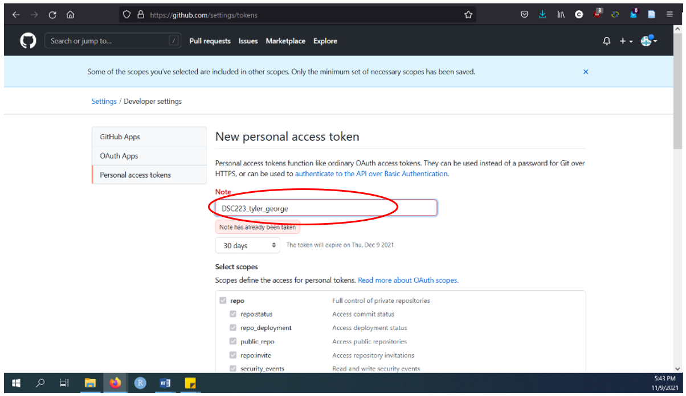
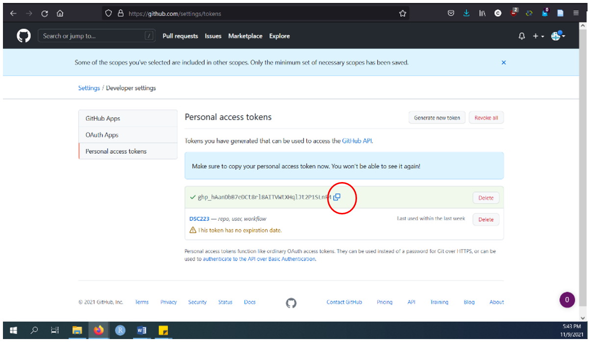
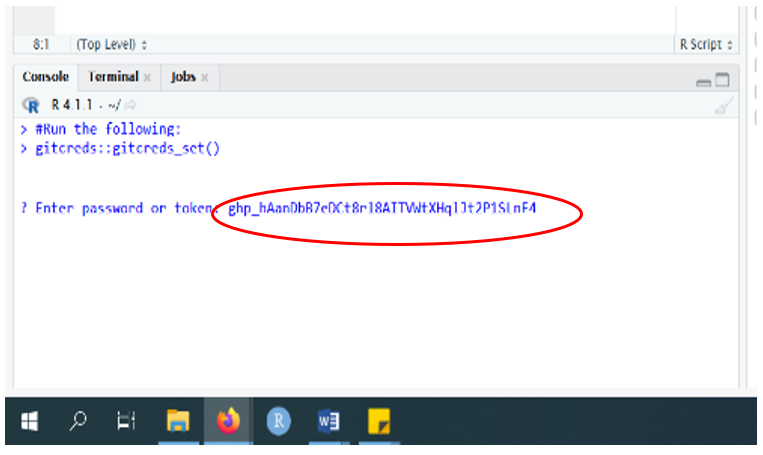
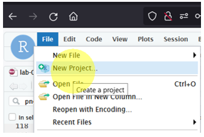
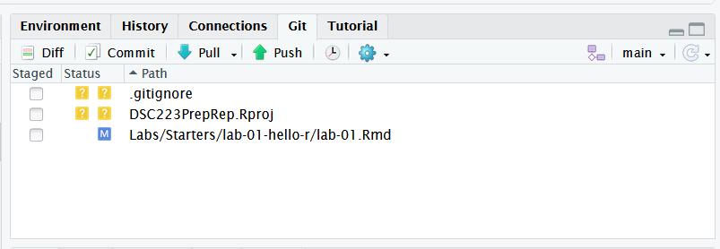
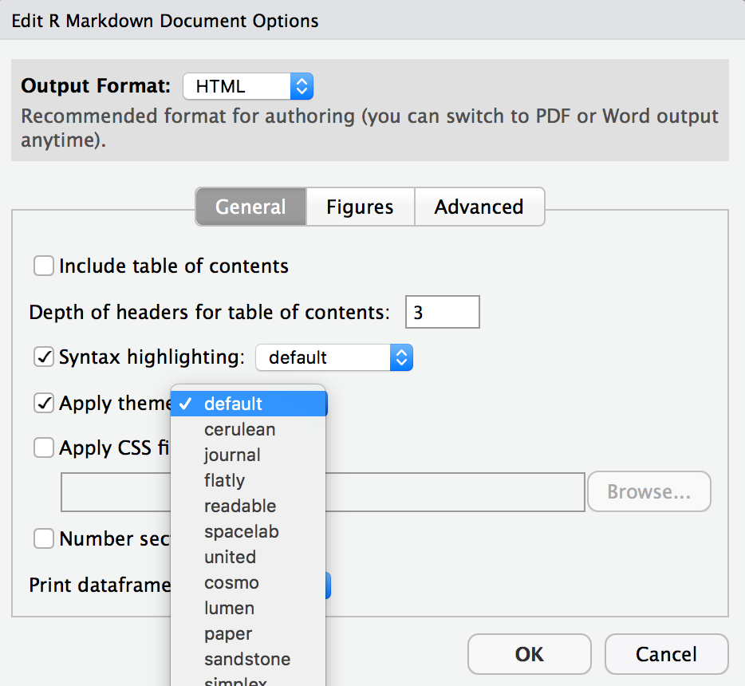

```{marginfigure}
R is the name of the programming language itself and RStudio is a convenient interface.
```


The main goal of this lab is to introduce you to R and RStudio, which we will be using throughout the course both to learn the statistical concepts discussed in the course and to analyze real data and come to informed conclusions.

```{marginfigure}
git is a version control system (like "Track Changes" features from Microsoft Word on steroids) and GitHub is the home for your Git-based projects on the internet (like DropBox but much, much better).
```

An additional goal is to introduce you to Git and GitHub, which is the collaboration and version control system that we will be using throughout the course.

As the labs progress, you are encouraged to explore beyond what the labs dictate; a willingness to experiment will make you a much better programmer.
Before we get to that stage, however, you need to build some basic fluency in R.
Today we begin with the fundamental building blocks of R and RStudio: the interface, reading in data, and basic commands.

And to make versioning simpler, this is a solo lab.
Additionally, we want to make sure everyone gets a significant amount of time at the steering wheel.
In future labs you'll learn about collaborating on GitHub and produce a single lab report for your team.


# Changing your RServer Password
In the bottom left corner of RStudio, you should see "Terminal" tab. Click that and run the line
```{r eval=FALSE}
passwd
```
Now you should be prompted to put in your current password. The default is **abc123**.

Next you will need to enter your new password once, click enter, and enter it again. That is your new password for logging into RStudio Server. 

Now, click back in the lower left corner of RStudio, click "Console" and continue the lab. 


# Connecting GitHub and RStudio Cloud

You should have already received an invitation to join the GitHub organization for this course.
You need to accept the invitation before moving on to the next step.

To connect your RStudio and GitHub accounts by following the steps below:

### Step 1
Run the following chunk in your lab RMarkdown. If you have popup blockers you may need to disable them. This will bring you to github and look like the image below. 

```{r eval=FALSE}
usethis::create_github_token()
```

```{r github-conn-1, echo = FALSE}
knitr::include_graphics("img/github-conn-1.PNG")
```

### Step 2
Sign into your GitHub account. 

### Step 3
Next you need to change the note box circled in the following image. This should be named something having to do with this class but has to be unique. For example \"DSC223-FB4-MyName.\" You are having Github create you a super secret secure password (essentialyl).It is called a Personal Access Token (PAT). 

```{r github-conn-2, echo = FALSE}

```

### Step 4
Next scroll all the way to the bottom and click \"Generate token\" as show in the image:

```{r github-conn-3, echo = FALSE}
knitr::include_graphics("img/github-conn-3.PNG")
```

### Step 5
We need this new code, click the copy button as shown in the next image. This puts the code on your clipboard to be pasted. Afterword comeback to this window. 

```{r github-conn-4, echo = FALSE}

```

### Step 6
Paste that code in your RMarkdown lab under step 6. 

### Step 7
Now, run the following chunk in your lab. Look at the console, paste in your PAT for the password. See the image for an example:
```{r eval = FALSE}
gitcreds::gitcreds_set() #Tells R to save your PAT to your RStudio user
```

```{r github-conn-5, echo = FALSE}

```


### Step 8
Click save (little floppy disk symbol at the top). See the image above. Note that you will need your PAT frequently. 

Yay! You did it!

# Getting started

Each of your assignments will begin with the following steps.
You saw these once in class yesterday, they're outlined in detail here again.
Going forward each lab will start with a "Getting started" section but details will be a bit more sparse than this.
You can always refer back to this lab for a detailed list of the steps involved for getting started with an assignment.

-   Click on the assignment link that you should have received in your email to create your GitHub repository (which we'll refer to as "repo" going forward) for the assignment. This repo contains a template you can build on to complete your assignment.

```{r clone-repo-link, fig.margin = TRUE, echo = FALSE, fig.width=3}
knitr::include_graphics("img/clone-repo-link.png")
```

-   On GitHub, click on the green **Clone or download** button, select **Use HTTPS** (this might already be selected by default, and if it is, you'll see the text **Clone with HTTPS** as in the image below). Click on the clipboard icon to copy the repo URL.

```{r new-project-from-gh1, fig.margin = TRUE, echo = FALSE, fig.width=3}

```
-   Go to RStudio Server. Create a **New Project**. You will need to click **File** and then **New Project**
```{r new-project-from-gh2, fig.margin = TRUE, echo = FALSE, fig.width=3}
knitr::include_graphics("img/new-project-from-gh_mod2.png")
```
\
\
\
-   Next, click **Version control**. 
```{r new-project-from-gh3, fig.margin = TRUE, echo = FALSE, fig.width=5}
knitr::include_graphics("img/new-project-from-gh_mod3.png")
```
\
\
\
\
\
-   Click **Git**.
```{r paste-gh-repo-url, fig.margin = TRUE, echo = FALSE, fig.width=3}
knitr::include_graphics("img/github-conn-10.PNG")
```
\
\
\
\
\
-   Copy and paste the URL of your assignment repo into the dialog box:
-   Hit OK, and you\'re good to go!
\
\
\

## Warm up

Before we introduce the data, let's warm up with some simple exercises.

```{marginfigure}
The top portion of your R Markdown file (between the three dashed lines) is called YAML. It stands for "YAML Ain't Markup Language". It is a human friendly data serialization standard for all programming languages. All you need to know is that this area is called the YAML (we will refer to it as such) and that it contains meta information about your document.
```

### YAML

Open the R Markdown (Rmd) file in your project, change the author name to your name, and knit the document.

```{r yaml-raw-to-rendered, fig.fullwidth=TRUE, echo = FALSE}
knitr::include_graphics("img/yaml-raw-to-rendered_mod.png")
```

### Committing changes

Then go to the Git pane in your RStudio and click on \"Commit\":
```{r gitpane, echo = FALSE}

```

If you have made changes to your Rmd file (which you just changed your name), you should see it listed here.
Click on it to select it in this list and then click on **Diff**.
This shows you the *diff*erence between the last committed state of the document and its current state that includes your changes.
If you're happy with these changes, write "Update author name" in the **Commit message** box and hit **Commit**.

```{r update-author-name-commit, fig.fullwidth=TRUE, echo = FALSE}
knitr::include_graphics("img/update-author-name-commit.png")
```

You don't have to commit after every change, this would get quite cumbersome.
You should consider committing states that are *meaningful to you* for inspection, comparison, or restoration.
In the first few assignments we will tell you exactly when to commit and in some cases, what commit message to use.
As the semester progresses we will let you make these decisions.

### Pushing changes

Now that you have made an update and committed this change, it's time to push these changes to the web!
Or more specifically, to your repo on GitHub.
Why?
So that others can see your changes.
And by others, we mean the course teaching team (your repos in this course are private to you and us, only).

In order to push your changes to GitHub, click on **Push**.
This will prompt a dialogue box where you first need to enter your user name, and then your password.
This might feel cumbersome.
Bear with me... We *will* teach you how to save your password so you don't have to enter it every time.
But for this one assignment you'll have to manually enter each time you push in order to gain some experience with it.

## Packages

In this lab we will work with two more packages: **datasauRus** which contains the dataset we'll be using and **tidyverse** which is a collection of packages for doing data analysis in a "tidy" way.
These packages are already installed for you.
You can load the packages by running the following in the Console.

```{r message=FALSE}
library(tidyverse) 
library(datasauRus)
```

Note that the packages are also loaded with the same commands in your R Markdown document.

## Data

```{marginfigure}
If it's confusing that the data frame is called `datasaurus_dozen` when it contains 13 datasets, you're not alone! Have you heard of a [baker's dozen](https://en.wikipedia.org/wiki/Dozen#Baker's_dozen)?
```

The data frame we will be working with today is called `datasaurus_dozen` and it's in the `datasauRus` package.
Actually, this single data frame contains 13 datasets, designed to show us why data visualisation is important and how summary statistics alone can be misleading.
The different datasets are marked by the `dataset` variable.

To find out more about the dataset, type the following in your Console: `?datasaurus_dozen`.
A question mark before the name of an object will always bring up its help file.
This command must be ran in the Console.

# Exercises

1.  Based on the help file, how many rows and how many columns does the `datasaurus_dozen` file have? What are the variables included in the data frame? Add your responses to your lab report.

Let's take a look at what these datasets are.
To do so we can make a *frequency table* of the dataset variable:

```{r}
datasaurus_dozen %>%
  count(dataset) %>%
  print(13)
```

```{marginfigure}
Matejka, Justin, and George Fitzmaurice. "Same stats, different graphs: Generating datasets with varied appearance and identical statistics through simulated annealing." Proceedings of the 2017 CHI Conference on Human Factors in Computing Systems. ACM, 2017.
```

The original Datasaurus (`dino`) was created by Alberto Cairo in [this great blog post](http://www.thefunctionalart.com/2016/08/download-datasaurus-never-trust-summary.html).
The other Dozen were generated using simulated annealing and the process is described in the paper *Same Stats, Different Graphs: Generating Datasets with Varied Appearance and Identical Statistics* through Simulated Annealing by Justin Matejka and George Fitzmaurice.
In the paper, the authors simulate a variety of datasets that have the same summary statistics as the Datasaurus but have very different distributions.

🧶 ✅ ⬆️ *Knit, commit, and push your changes to GitHub with the commit message "Added answer for Ex 1". Make sure to commit and push all changed files so that your Git pane is cleared up afterwards.*

2.  Plot `y` vs. `x` for the `dino` dataset. Then, calculate the correlation coefficient between `x` and `y` for this dataset.

Below is the code you will need to complete this exercise.
Basically, the answer is already given, but you need to include relevant bits in your Rmd document and successfully knit it and view the results.

Start with the `datasaurus_dozen` and pipe it into the `filter` function to filter for observations where `dataset == "dino"`.
Store the resulting filtered data frame as a new data frame called `dino_data`.

```{r}
dino_data <- datasaurus_dozen %>%
  filter(dataset == "dino")
```

There is a lot going on here, so let's slow down and unpack it a bit.

First, the pipe operator: `%>%`, takes what comes before it and sends it as the first argument to what comes after it.
So here, we're saying `filter` the `datasaurus_dozen` data frame for observations where `dataset == "dino"`.

Second, the assignment operator: `<-`, assigns the name `dino_data` to the filtered data frame.

Next, we need to visualize these data.
We will use the `ggplot` function for this.
Its first argument is the data you're visualizing.
Next we define the `aes`thetic mappings.
In other words, the columns of the data that get mapped to certain aesthetic features of the plot, e.g. the `x` axis will represent the variable called `x` and the `y` axis will represent the variable called `y`.
Then, we add another layer to this plot where we define which `geom`etric shapes we want to use to represent each observation in the data.
In this case we want these to be points, hence `geom_point`.

```{r fig.fullwidth=TRUE}
ggplot(data = dino_data, mapping = aes(x = x, y = y)) +
  geom_point()
```

If this seems like a lot, it is.
And you will learn about the philosophy of building data visualizations in layer in detail next week.
For now, follow along with the code that is provided.

For the second part of these exercises, we need to calculate a summary statistic: the correlation coefficient.
Correlation coefficient, often referred to as $r$ in statistics, measures the linear association between two variables.
You will see that some of the pairs of variables we plot do not have a linear relationship between them.
This is exactly why we want to visualize first: visualize to assess the form of the relationship, and calculate $r$ only if relevant.
In this case, calculating a correlation coefficient really doesn't make sense since the relationship between `x` and `y` is definitely not linear -- it's dinosaurial!

But, for illustrative purposes, let's calculate the correlation coefficient between `x` and `y`.

```{marginfigure}
Start with `dino_data` and calculate a summary statistic that we will call `r` as the `cor`relation between `x` and `y`.
```

```{r}
dino_data %>%
  summarize(r = cor(x, y))
```

🧶 ✅ ⬆️ *Knit, commit, and push your changes to GitHub with the commit message "Added answer for Ex 2". Make sure to commit and push all changed files so that your Git pane is cleared up afterwards.*

3.  Plot `y` vs. `x` for the `star` dataset. You can (and should) reuse code we introduced above, just replace the dataset name with the desired dataset. Then, calculate the correlation coefficient between `x` and `y` for this dataset. How does this value compare to the `r` of `dino`?

🧶 ✅ ⬆️ *This is another good place to pause, knit, commit changes with the commit message "Added answer for Ex 3", and push. Make sure to commit and push all changed files so that your Git pane is cleared up afterwards.*

4.  Plot `y` vs. `x` for the `circle` dataset. You can (and should) reuse code we introduced above, just replace the dataset name with the desired dataset. Then, calculate the correlation coefficient between `x` and `y` for this dataset. How does this value compare to the `r` of `dino`?

🧶 ✅ ⬆️ *You should pause again, commit changes with the commit message "Added answer for Ex 4", and push. Make sure to commit and push all changed files so that your Git pane is cleared up afterwards.*

```{marginfigure}
Facet by the dataset variable, placing the plots in a 3 column grid, and don't add a legend.
```

5.  Finally, let's plot all datasets at once. In order to do this we will make use of faceting.

```{r all-viz, eval=FALSE, fig.fullwidth=TRUE}
ggplot(datasaurus_dozen, aes(x = x, y = y, color = dataset))+
  geom_point()+
  facet_wrap(~ dataset, ncol = 3) +
  theme(legend.position = "none")
```

And we can use the `group_by` function to generate all the summary correlation coefficients.

```{r all-r, eval=FALSE}
datasaurus_dozen %>%
  group_by(dataset) %>%
  summarize(r = cor(x, y)) %>%
  print(13)
```

You're done with the data analysis exercises, but we'd like you to do two more things:

```{r fig-resize-global, fig.margin = TRUE, echo = FALSE, fig.width=3}
knitr::include_graphics("img/fig-resize-global.png")
```

-   **Resize your figures:**

Click on the gear icon in on top of the R Markdown document, and select "Output Options..." in the dropdown menu.
In the pop up dialogue box go to the Figures tab and change the height and width of the figures, and hit OK when done.
Then, knit your document and see how you like the new sizes.
Change and knit again and again until you're happy with the figure sizes.
Note that these values get saved in the YAML.

```{r fig-resize-local, fig.margin = TRUE, echo = FALSE, fig.width=3}
knitr::include_graphics("img/fig-resize-local.png")
```

You can also use different figure sizes for differen figures.
To do so click on the gear icon within the chunk where you want to make a change.
Changing the figure sizes added new options to these chunks: `fig.width` and `fig.height`.
You can change them by defining different values directly in your R Markdown document as well.

```{r theme-highlight, fig.margin = TRUE, echo = FALSE, fig.width=3}

```

-   **Change the look of your report:**

Once again click on the gear icon in on top of the R Markdown document, and select "Output Options..." in the dropdown menu.
In the General tab of the pop up dialogue box try out different Syntax highlighting and theme options.
Hit OK and knit your document to see how it looks.
Play around with these until you're happy with the look.

<br>

```{marginfigure}
Not sure how to use emojis on your computer? Maybe a teammate can help? Or you can ask your TA as well!
```

🧶 ✅ ⬆️ *Yay, you're done! Commit all remaining changes, use the commit message "Done with Lab 1!* 💪*", and push. Make sure to commit and push all changed files so that your Git pane is cleared up afterwards. Before you wrap up the assignment, make sure all documents are updated on your GitHub repo.*
