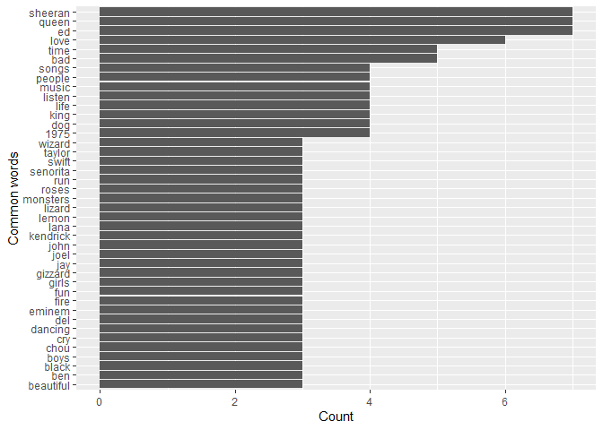
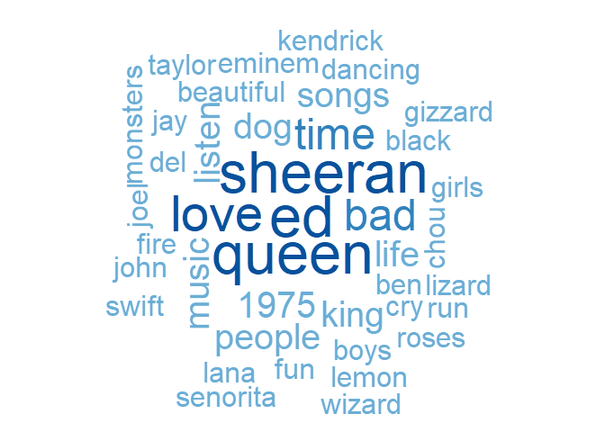

Lab 16 - tidytext
================
Tyler George  
Based on Materials from Julia Silge’s Workshop
[Here](https://github.com/juliasilge/tidytext-tutorial)  
Lab Outline by Mine Çetinkaya-Rundel

# Learning goals

-   Learn text mine (text analysis) terminology
-   Introduction to tidytext
-   Sentiment analysis
-   term frequency (tf) and inverse document frequency (idf)
    (wordlcouds)
-   Ngrams and network analysis

# Getting started

Go to the course GitHub organization and locate your lab repo, clone it
in RStudio and open the R Markdown document. Knit the document to make
sure it compiles without errors.

## Warm up

Let’s warm up with some simple exercises. Update the YAML of your R
Markdown file with your information, knit, commit, and push your
changes. Make sure to commit with a meaningful commit message. Then, go
to your repo on GitHub and confirm that your changes are visible in your
Rmd **and** md files. If anything is missing, commit and push again.

## Packages

In addition to `tidyverse` we will be using four other packages today

## Tidytext

-   Using tidy data principles can make many text mining tasks easier,
    more effective, and consistent with tools already in wide use.
-   Learn more at <https://www.tidytextmining.com/>.

## Follow along

Fill in the blanks as we go along and run the R chunks

**There Is a Light That Never Goes Out** by The Smiths

``` r
text <- c("Take me out tonight",
          "Where there's music and there's people",
          "And they're young and alive",
          "Driving in your car",
          "I never never want to go home",
          "Because I haven't got one",
          "Anymore")
```

``` r
text_df <- tibble(line = 1:7, text = text)

text_df
```

    ## # A tibble: 7 x 2
    ##    line text                                  
    ##   <int> <chr>                                 
    ## 1     1 Take me out tonight                   
    ## 2     2 Where there's music and there's people
    ## 3     3 And they're young and alive           
    ## 4     4 Driving in your car                   
    ## 5     5 I never never want to go home         
    ## 6     6 Because I haven't got one             
    ## 7     7 Anymore

``` r
text_df %>%
  unnest_tokens(word, text)
```

    ## # A tibble: 32 x 2
    ##     line word   
    ##    <int> <chr>  
    ##  1     1 take   
    ##  2     1 me     
    ##  3     1 out    
    ##  4     1 tonight
    ##  5     2 where  
    ##  6     2 there's
    ##  7     2 music  
    ##  8     2 and    
    ##  9     2 there's
    ## 10     2 people 
    ## # ... with 22 more rows

#### What is your favorite song?

(Excluding those with derogatory words)

``` r
listening <- read_csv("data/listening.csv")
listening
```

    ## # A tibble: 104 x 1
    ##    songs                                                                        
    ##    <chr>                                                                        
    ##  1 Gamma Knife - King Gizzard and the Lizard Wizard; Self Immolate - King Gizza~
    ##  2 I dont listen to much music                                                  
    ##  3 Mess by Ed Sheeran, Take me back to london by Ed Sheeran and Sounds of the S~
    ##  4 Hate Me (Sometimes) - Stand Atlantic; Edge of Seventeen - Stevie Nicks; It's~
    ##  5 whistle, gogobebe, sassy me                                                  
    ##  6 Shofukan, Think twice, Padiddle                                              
    ##  7 Groundislava - Feel the Heat (Indecorum Remix), Nominal - Everyday Everyone ~
    ##  8 Loving you - passion the musical, Senorita - Shawn Mendes and Camilla Cabell~
    ##  9 lay it down slow - spiritualised, dead boys - Sam Fender, figure it out - Ro~
    ## 10 Don't Stop Me Now (Queen), Finale (Toby Fox), Machine in the Walls (Mudeth)  
    ## # ... with 94 more rows

#### Looking for commonalities

``` r
listening %>%
  unnest_tokens(word, songs) %>%
  count(word, sort = TRUE)
```

    ## # A tibble: 786 x 2
    ##    word      n
    ##    <chr> <int>
    ##  1 the      56
    ##  2 by       23
    ##  3 to       20
    ##  4 and      19
    ##  5 i        19
    ##  6 you      15
    ##  7 of       13
    ##  8 a        11
    ##  9 in       11
    ## 10 me       10
    ## # ... with 776 more rows

#### Stop words

-   In computing, stop words are words which are filtered out before or
    after processing of natural language data (text).
-   They usually refer to the most common words in a language, but there
    is not a single list of stop words used by all natural language
    processing tools.

#### English stop words

``` r
get_stopwords()
```

    ## # A tibble: 175 x 2
    ##    word      lexicon 
    ##    <chr>     <chr>   
    ##  1 i         snowball
    ##  2 me        snowball
    ##  3 my        snowball
    ##  4 myself    snowball
    ##  5 we        snowball
    ##  6 our       snowball
    ##  7 ours      snowball
    ##  8 ourselves snowball
    ##  9 you       snowball
    ## 10 your      snowball
    ## # ... with 165 more rows

#### Spanish stop words

``` r
get_stopwords(language = "es")
```

    ## # A tibble: 308 x 2
    ##    word  lexicon 
    ##    <chr> <chr>   
    ##  1 de    snowball
    ##  2 la    snowball
    ##  3 que   snowball
    ##  4 el    snowball
    ##  5 en    snowball
    ##  6 y     snowball
    ##  7 a     snowball
    ##  8 los   snowball
    ##  9 del   snowball
    ## 10 se    snowball
    ## # ... with 298 more rows

#### Various lexicons

See `?get_stopwords` for more info.

``` r
get_stopwords(source = "smart")
```

    ## # A tibble: 571 x 2
    ##    word        lexicon
    ##    <chr>       <chr>  
    ##  1 a           smart  
    ##  2 a's         smart  
    ##  3 able        smart  
    ##  4 about       smart  
    ##  5 above       smart  
    ##  6 according   smart  
    ##  7 accordingly smart  
    ##  8 across      smart  
    ##  9 actually    smart  
    ## 10 after       smart  
    ## # ... with 561 more rows

#### Back to: Looking for commonalities

``` r
listening %>%
  unnest_tokens(word, songs) %>%
  anti_join(stop_words) %>%                           #<<
  filter(!(word %in% c("1", "2", "3", "4", "5"))) %>% #<<
  count(word, sort = TRUE)
```

    ## Joining, by = "word"

    ## # A tibble: 640 x 2
    ##    word        n
    ##    <chr>   <int>
    ##  1 ed          7
    ##  2 queen       7
    ##  3 sheeran     7
    ##  4 love        6
    ##  5 bad         5
    ##  6 time        5
    ##  7 1975        4
    ##  8 dog         4
    ##  9 king        4
    ## 10 life        4
    ## # ... with 630 more rows

#### Top 20 common words in songs

``` r
top20_songs <- listening %>%
  unnest_tokens(word, songs) %>%
  anti_join(stop_words) %>%
  filter(
    !(word %in% c("1", "2", "3", "4", "5"))
    ) %>%
  count(word) %>%
  top_n(20)

top20_songs %>%
  arrange(desc(n))
```

    ## # A tibble: 41 x 2
    ##    word        n
    ##    <chr>   <int>
    ##  1 ed          7
    ##  2 queen       7
    ##  3 sheeran     7
    ##  4 love        6
    ##  5 bad         5
    ##  6 time        5
    ##  7 1975        4
    ##  8 dog         4
    ##  9 king        4
    ## 10 life        4
    ## # ... with 31 more rows

#### Visualizing commonalities: bar chart

``` r
top20_songs %>%
  ggplot(aes(x = fct_reorder(word, n), y = n)) +
  geom_col() +
  labs(x = "Common words", y = "Count") +
  coord_flip()
```

<!-- -->

#### Visualizing commonalities: wordcloud

``` r
set.seed(1234)
wordcloud(words = top20_songs$word, 
          freq = top20_songs$n, 
          colors = brewer.pal(5,"Blues"),
          random.order = FALSE)
```

<!-- -->

``` r
#Note: You may need to increase the size of your plot area to get this to display properly
```

🧶 ✅ ⬆️ *If you haven’t done so recently, knit, commit, and push your
changes to GitHub with an appropriate commit message. Make sure to
commit and push all changed files so that your Git pane is cleared up
afterwards.*
