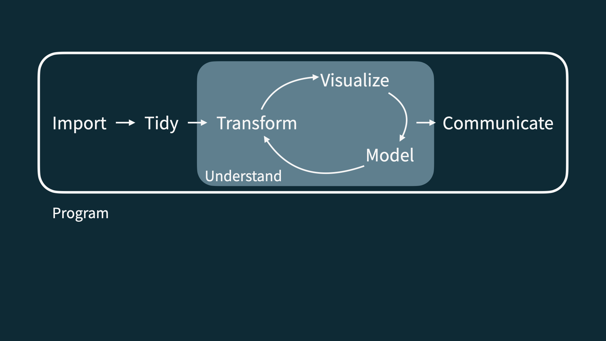
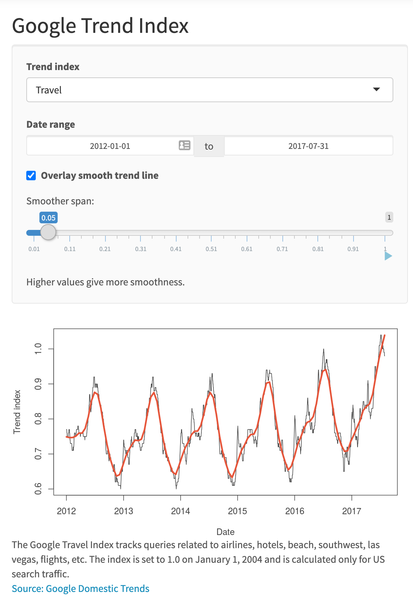
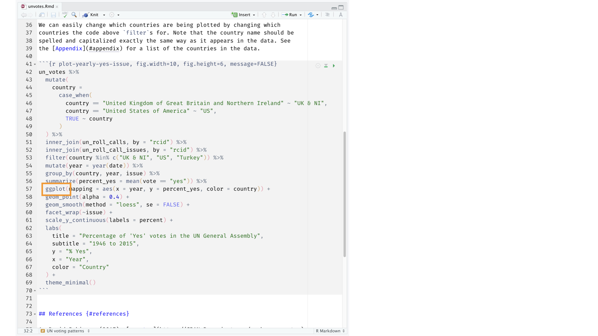

```{r child = "../setup.Rmd"}
```

```{r packages, echo=FALSE, message=FALSE, warning=FALSE}
library(tidyverse)
library(emo)
packageVersion("xaringan")
```

class: middle

# Hello world!

---

class: .my-one-page-font

## Data science


.pull-left-wide[
- Data science is an exciting discipline that allows you to turn raw data into understanding, insight, and knowledge. 

- We're going to learn to do this in a `tidy` way -- more on that later!

- This is a course on introduction to data science, with an emphasis on statistical thinking.
]


---

## Course FAQ

.pull-left-wide[
**Q - What data science background does this course assume?**  
A - None.

**Q - Is this an intro stat course?**  
A - While statistics $\ne$ data science, they are very closely related and have tremendous of overlap. Hence, this course is a great way to get started with statistics. However this course is *not* your typical high school statistics course.

**Q - Will we be doing computing?**   
A - Yes.
]

---

## Course FAQ

.pull-left-wide[
**Q - Is this an intro CS course?**  
A - No, but many themes are shared.

**Q - What computing language will we learn?**  
A - R.

**Q: Why not language X?**  
A: We can discuss that over `r emo::ji("coffee")`.
]

---

class: middle

# Software

---

```{r echo=FALSE, out.width="75%", fig.align="left"}
knitr::include_graphics("img/excel.png")
```

---

```{r echo=FALSE, out.width="50%", fig.align="left"}
knitr::include_graphics("img/r.png")
```

---

```{r echo=FALSE, out.width="73%", fig.align="left"}
knitr::include_graphics("img/rstudio.png")
```

---

class: middle

# Data science life cycle

---

```{r echo=FALSE, out.width="90%", fig.align="left"}
knitr::include_graphics("img/data-science-cycle/data-science-cycle.001.png")
```

---

```{r echo=FALSE, out.width="90%", fig.align="left"}
knitr::include_graphics("img/data-science-cycle/data-science-cycle.002.png")
```

---

```{r echo=FALSE, out.width="90%", fig.align="left"}
knitr::include_graphics("img/data-science-cycle/data-science-cycle.003.png")
```

---

```{r echo=FALSE, out.width="90%", fig.align="left"}
knitr::include_graphics("img/data-science-cycle/data-science-cycle.004.png")
```

---

```{r echo=FALSE, out.width="90%", fig.align="left"}
knitr::include_graphics("img/data-science-cycle/data-science-cycle.005.png")
```

---

.pull-left[
```{r echo=FALSE, out.width="90%", fig.align="left"}

```
]
???

Let's consider an example...

---

.pull-left[
```{r echo=FALSE, out.width="90%", fig.align="left"}

```
]
.pull-right[
```{r echo=FALSE, out.width="75%", fig.align="right"}

```
]
???

Google Trend Index: 
- Numerical summary of popularity of search words on Google. 
- Travel index, 2012 - 2017 and united states
- Any interesting features? 

---

.pull-left[
```{r echo=FALSE, out.width="75%", fig.align="left"}

```
]
.pull-right[
```{r echo=FALSE, out.width="90%", fig.align="right"}

```

```{r echo=F}
travel <- tribble(
  ~date,              ~season,
  "23 January 2017",  "winter",
  "4 March 2017",     "spring",
  "14 June 2017",     "summer",
  "1 September 2017", "fall",
  "...", "..."
)
travel
```
]
???

- This a "snippet" of our data
- We have the exact data that each index was recorded
- Possibly what we want is to just aggregate by season and eliminating the seasonal affect to see the larger time span trend

---

```{r echo=FALSE, out.width="90%", fig.align="left"}
knitr::include_graphics("img/data-science-cycle/data-science-cycle.007.png")
```
???

The end goal: Communicating

---

```{r echo=FALSE, out.width="90%", fig.align="left"}
knitr::include_graphics("img/data-science-cycle/data-science-cycle.008.png")
```
???

This becomes a cycle - the communication/goals will often lead to changes in your model. 

---

```{r echo=FALSE, out.width="90%", fig.align="left"}
knitr::include_graphics("img/data-science-cycle/data-science-cycle.009.png")
```
???

To make this all happen: we need to program!
---

```{r echo=FALSE, out.width="85%", fig.align="left"}
knitr::include_graphics("img/unvotes/unvotes.gif")
```

???

We want to go from left to right!

---

class: middle

# Let's dive in!

---

background-image: url("img/unvotes/unvotes-01.jpeg")

???

We are going to look at United Nations General Assembly and how countries have been voting.

---

class: inverse

```{r echo=FALSE, out.width="100%", fig.align="left"}
knitr::include_graphics("img/unvotes/unvotes-02.jpeg")
```

---

class: inverse
.pull-left-wide[
```{r echo=FALSE, out.width="100%", fig.align="left"}
knitr::include_graphics("img/unvotes/unvotes-02.jpeg")
```
]
.pull-right-narrow[
- Where can we find the issues for each visualization? 
- Which countries are being visualized? Why Turkey? UK? US? 
- What is our response? What is on our y-axis? 
- What is our predictors? What is on the x-axis? 
]

---

class: inverse

```{r echo=FALSE, out.width="100%"}
knitr::include_graphics("img/unvotes/unvotes-03.jpeg")
```

---

class: inverse

```{r echo=FALSE, out.width="100%"}
knitr::include_graphics("img/unvotes/unvotes-04.jpeg")
```

---

class: inverse

```{r echo=FALSE, out.width="100%"}
knitr::include_graphics("img/unvotes/unvotes-05.jpeg")
```

???

We call each plot square a facet; this will matter to us later

---

class: inverse

```{r echo=FALSE, out.width="100%"}
knitr::include_graphics("img/unvotes/unvotes-06.jpeg")
```

???

- What do we notice about trends in Palestinian conflict or colonialism compared to the other plots when comparing countries? 
- Does this make real world sense?
- Real world vs out plots

---

class: inverse

```{r echo=FALSE, out.width="100%"}
knitr::include_graphics("img/unvotes/unvotes-07.jpeg")
```

???

- Making this vizz
- Three different data set sources

---

class: inverse

```{r echo=FALSE, out.width="90%"}
knitr::include_graphics("img/unvotes/unvotes-08.jpeg")
```

???

- We are not to coding yet!
- Notice the three dataset names are all in here

---

class: inverse

```{r echo=FALSE, out.width="90%"}
knitr::include_graphics("img/unvotes/unvotes-09.jpeg")
```

???

To get the datasets together we used "joins"

---

class: inverse

```{r echo=FALSE, out.width="90%"}
knitr::include_graphics("img/unvotes/unvotes-10.jpeg")
```

???

We then used something called "filter" and it our graph only shows data in the three countries we saw

---

class: inverse

```{r echo=FALSE, out.width="90%"}

```

???

- To great these plots we use something called "ggplot"
- Together we joined data, filtered countries and generated the plots

---

class: inverse

```{r echo=FALSE, out.width="90%"}
knitr::include_graphics("img/unvotes/unvotes-12.jpeg")
```

???

- Some of these terms should make sense
---

class: inverse

```{r echo=FALSE, out.width="100%"}
knitr::include_graphics("img/unvotes/unvotes-13.jpeg")
```

???

- Back to large code from earlier
- "Rmarkdown" - analysis and prose together, allows us to put text and code together

---

class: inverse

```{r echo=FALSE, out.width="100%"}
knitr::include_graphics("img/unvotes/unvotes-14.jpeg")
```

???

In an R markdown file we have some stuff at the top we need to specify. 

---

.center[
.large[
[minecr.shinyapps.io/unvotes](https://minecr.shinyapps.io/unvotes/)
]
]

```{r echo=FALSE, out.width="65%"}
knitr::include_graphics("img/unvotes/unvotes-15.png")
```

---

# Starting Simple
- We will be using base R via JupyterHub (URL)