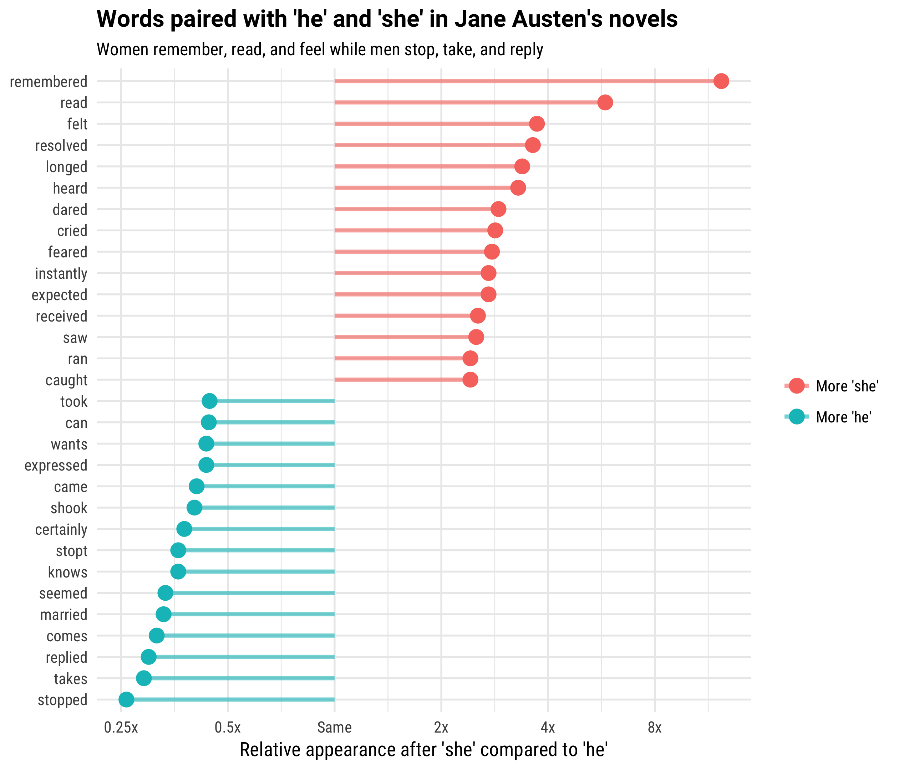
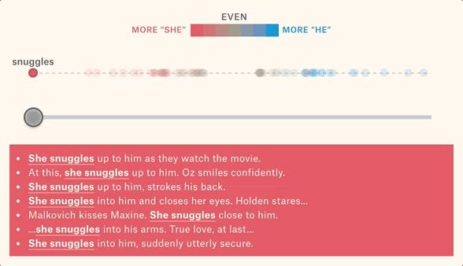
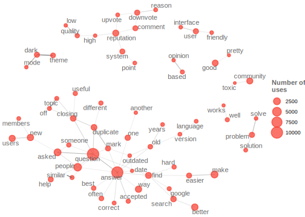

## Packages

In addition to `tidyverse` we will be using four other packages today

```{r message=FALSE,warning=F}
library(tidyverse)
library(tidytext)
library(genius)
library(wordcloud)
library(DT)
library(stopwords)
conflicted::conflict_prefer("filter","dplyr")
```

---

## Tidytext

- Using tidy data principles can make many text mining tasks easier, more effective, and consistent with tools already in wide use.
- Learn more at https://www.tidytextmining.com/.

---

## What is tidy text?

*There Is a Light That Never Goes Out* by The Smiths 

```{r}
text <- c("Take me out tonight",
          "Where there's music and there's people",
          "And they're young and alive",
          "Driving in your car",
          "I never never want to go home",
          "Because I haven't got one",
          "Anymore")

text
```

---

## What is tidy text?

```{r}
text_df <- tibble(line = 1:7, text = text)

text_df
```

---

## What is tidy text?

```{r}
text_df %>%
  unnest_tokens(word, text)
```

---

class: middle

# What are you listening to?

---

## From class survey(s)

> What is your favorite song? (excluding those with derogatory words)

.midi[
```{r message=FALSE}
listening <- read_csv("data/listening.csv")
listening
```
]

---

## Looking for commonalities

.midi[
```{r}
listening %>%
  unnest_tokens(word, songs) %>%
  count(word, sort = TRUE)
```
]

---

## Stop words

- In computing, stop words are words which are filtered out before or after processing of natural language data (text).
- They usually refer to the most common words in a language, but there is not a single list of stop words used by all natural language processing tools.

---

## English stop words

```{r}
get_stopwords()
```

---

## Spanish stop words

```{r}
get_stopwords(language = "es")
```

---

## Various lexicons

See `?get_stopwords` for more info.

.midi[
```{r}
get_stopwords(source = "smart")
```
]

---

## Back to: Looking for commonalities

```{r}
listening %>%
  unnest_tokens(word, songs) %>%
  anti_join(stop_words) %>%                           #<<
  dplyr::filter(!(word %in% c("1", "2", "3", "4", "5"))) %>% #<<
  count(word, sort = TRUE)
```

---

## Top 20 common words in songs

.pull-left[
.small[
```{r message=FALSE}
top20_songs <- listening %>%
  unnest_tokens(word, songs) %>%
  anti_join(stop_words) %>%
  dplyr::filter(
    !(word %in% c("1", "2", "3", "4", "5"))
    ) %>%
  count(word) %>%
  top_n(20)
```
]
]
.pull-right[
.midi[
```{r}
top20_songs %>%
  arrange(desc(n))
```
]
]
---

## Visualizing commonalities: bar chart

.midi[
```{r echo=FALSE}
top20_songs %>%
  ggplot(aes(x = fct_reorder(word, n), y = n)) +
  geom_col() +
  labs(x = "Common words", y = "Count") +
  coord_flip()
```
]

---

... the code

```{r eval=FALSE}
ggplot(top20_songs, aes(x = fct_reorder(word, n), y = n)) +
  geom_col() +
  labs(x = "Common words", y = "Count") +
  coord_flip()
```


---

## Visualizing commonalities: wordcloud

```{r echo=FALSE, out.width="70%"}
set.seed(1234)
wordcloud(words = top20_songs$word, 
          freq = top20_songs$n, 
          colors = brewer.pal(5,"Blues"),
          random.order = FALSE, 
          rot.per = 0.35,
          scale = c(2, 0.5))
```

---

... and the code

```{r eval=FALSE}
set.seed(1234)
wordcloud(words = top20_songs$word, 
          freq = top20_songs$n, 
          colors = brewer.pal(5,"Blues"),
          random.order = FALSE)
```

---

class: middle

# Analyzing lyrics of one artist
## Let's get more data

We'll use the **genius** package to get song data from [Genius](https://genius.com/).

- `genius_album()`: download artists, and track names an entire album
- `add_genius()`: download for multiple albums
- The author of this package recently decided to end support for it for pulling lyrics. It relied on web-scraping and he did not want to support any misuse of the artists lyrics they own.
- This is a particularly alarming problem when someone starts to use your tools on a massive scale. 
- He may have intended for people to do what we are doing - pulling in a few lyrics. 
- The result was likely companies using his tool to do large scale data analysis projects about artists and their lyrics (likely for marketing)

---

## Singers most recent-ish albums
Taylors most recent album. 
```{r cache=TRUE, message=FALSE, warning=FALSE}
artist_albums <- tribble(
  ~artist,      ~album,
  "Taylor Swift", "Red (Taylor's Version)")

artist <- artist_albums %>%
  add_genius(artist, album, "album")

# attach the lyrics (the genius functions no longer supported)
artist_lyrics <- read_csv('data/artistlyrics.csv')
artist <- artist %>%
  mutate(track_title = str_squish(track_title))%>%
  left_join(artist_lyrics,by="track_title") %>%
  mutate(lyric = str_replace_all(lyric,"\\\n|\\[.*\\]"," "),
         lyric = str_squish(lyric))

```

---

## Songs in the four albums

.small[
```{r echo=FALSE}
options(htmltools.preserve.raw = FALSE)
artist %>%
  distinct(album, track_title) %>%
  datatable(options = list(dom = "p"))
```
]

---

## Tidy up your lyrics!

```{r}
artist_lyrics <- artist %>%
  unnest_tokens(word, lyric)

artist_lyrics
```

---

## What are the most common words?

```{r}
artist_lyrics %>%
  count(word, sort = TRUE)
```

---

## Remove Stop Words

.midi[
```{r}
artist_lyrics %>%
  anti_join(stop_words) %>%
  count(word, sort = TRUE)
```
]

---

```{r echo=FALSE, message=FALSE, out.width="60%"}
artist_lyrics %>%
  anti_join(stop_words) %>%
  count(word)%>%
  top_n(20) %>%
  ggplot(aes(fct_reorder(word, n), n)) +
    geom_col() +
    labs(title = "Frequency of Artists lyrics",
         y = "",
         x = "") +
    coord_flip()
```

---

... and the code

```{r eval=FALSE}
artist_lyrics %>%
  anti_join(stop_words) %>%
  count(word)%>%
  top_n(20) %>%
  ggplot(aes(fct_reorder(word, n), n)) +
    geom_col() +
    labs(title = "Frequency of Artists lyrics",
         y = "",
         x = "") +
    coord_flip()
```

---

class: middle

# Sentiment analysis

---

## Sentiment analysis

- One way to analyze the sentiment of a text is to consider the text as a combination of its individual words 
- and the sentiment content of the whole text as the sum of the sentiment content of the individual words

---

## Sentiment lexicons

.pull-left[
```{r}
get_sentiments("afinn")
```
]
.pull-right[
```{r}
get_sentiments("bing") 
```
]

---

## Sentiment lexicons

.pull-left[
```{r}
get_sentiments("nrc")
```
]
.pull-right[
```{r}
get_sentiments("loughran") 
```
]

---

class: middle

## Categorizing sentiments

---

## Sentiments in Artists lyrics

.midi[
```{r}
artist_lyrics %>%
  inner_join(get_sentiments("bing")) %>%
  count(sentiment, word, sort = TRUE)
```
]

---

class: middle

**Goal:** Find the top 10 most common words with positive and negative sentiments.

---

### Step 1: Top 10 words for each sentiment

.midi[
```{r message=FALSE}
artist_lyrics %>%
  inner_join(get_sentiments("bing")) %>%
  count(sentiment, word) %>%
  group_by(sentiment) %>%
  top_n(10) 
```
]

---

### Step 2: `ungroup()`

.midi[
```{r message=FALSE}
artist_lyrics %>%
  inner_join(get_sentiments("bing")) %>%
  count(sentiment, word) %>%
  group_by(sentiment) %>%
  top_n(10) %>%
  ungroup()
```
]

---

### Step 3: Save the result

```{r message=FALSE}
artist_top10 <- artist_lyrics %>%
  inner_join(get_sentiments("bing")) %>%
  count(sentiment, word) %>%
  group_by(sentiment) %>%
  top_n(10) %>%
  ungroup()
```

---

### Step 1: Create a bar chart

.midi[
```{r message=FALSE, out.width="40%"}
artist_top10 %>%
  ggplot(aes(x = word, y = n, fill = sentiment)) +
  geom_col()
```
]

---

### Step 2: Order bars by frequency

.midi[
```{r message=FALSE, out.width="40%"}
artist_top10 %>%
  ggplot(aes(x = fct_reorder(word, n), y = n, fill = sentiment)) +
  geom_col()
```
]

---

### Step 3: Facet by sentiment

.midi[
```{r message=FALSE, out.width="40%"}
artist_top10 %>%
  ggplot(aes(x = fct_reorder(word, n), y = n, fill = sentiment)) +
  geom_col() +
  facet_wrap(~ sentiment)
```
]

---

### Step 4: Free the scales!

.midi[
```{r message=FALSE, out.width="40%"}
artist_top10 %>%
  ggplot(aes(x = fct_reorder(word, n), y = n, fill = sentiment)) +
  geom_col() +
  facet_wrap(~ sentiment, scales = "free")
```
]

---

### Step 4: Flip the coordinates

.midi[
```{r message=FALSE, out.width="35%"}
artist_top10 %>%
  ggplot(aes(x = fct_reorder(word, n), y = n, fill = sentiment)) +
  geom_col() +
  facet_wrap(~ sentiment, scales = "free") +
  coord_flip()
```
]

---

### Step 5: Clean up labels

.small[
```{r message=FALSE, out.width="40%"}
artist_top10 %>%
  ggplot(aes(x = fct_reorder(word, n), y = n, fill = sentiment)) +
  geom_col() +
  facet_wrap(~ sentiment, scales = "free") +
  coord_flip() +
  labs(title = "Sentiments in Artists lyrics", x = "", y = "")
```
]

---

### Step 6: Remove redundant info

.small[
```{r message=FALSE, out.width="40%"}
artist_top10 %>%
  ggplot(aes(x = fct_reorder(word, n), y = n, fill = sentiment)) +
  geom_col() +
  facet_wrap(~ sentiment, scales = "free") +
  coord_flip() +
  labs(title = "Sentiments in Artists lyrics", x = "", y = "") +
  guides(fill = "none") 
```
]

---

class: middle

## Scoring sentiments

---

## Assign a sentiment score

.small[
```{r}
artist_lyrics %>%
  anti_join(stop_words) %>%
  left_join(get_sentiments("afinn")) 
```
]

---

```{r message=FALSE}
artist_lyrics %>%
  anti_join(stop_words) %>%
  left_join(get_sentiments("afinn")) %>%
  dplyr::filter(!is.na(value)) %>%
  group_by(album) %>%
  summarise(total_sentiment = sum(value)) %>%
  arrange(total_sentiment)
```

---

```{r echo=FALSE, message=FALSE, warning=FALSE}
artist_lyrics %>%
  anti_join(stop_words) %>%
  left_join(get_sentiments("afinn")) %>%
  dplyr::filter(!is.na(value)) %>%
  group_by(album, track_title) %>%
  summarise(total_sentiment = sum(value)) %>%
  ungroup() %>%
  arrange(total_sentiment) %>%
  mutate(
    track_title = str_remove(track_title, "by (.*)") %>% str_trim(),
    track_title = str_remove(track_title, "\\(.*\\)") %>% str_trim(),
    total_sentiment_sign = if_else(total_sentiment < 0, "negative", "positive")
  ) %>%
  ggplot(aes(x = reorder(track_title, total_sentiment), y = total_sentiment, fill = total_sentiment_sign)) +
  geom_col() +
  facet_wrap(~album, ncol = 2, scales = "free") +
  guides(fill = "none") +
  coord_flip() +
  labs(x = "", y = "", 
    title = "Total sentiment score of Artists tracks",
    subtitle = "Scored with AFINN sentiment lexicon")
```

---


## Text Analysis on a Text - Gathering more data

You can access the full text of many public domain works from Project Gutenberg using the gutenbergr package.

We are pulling from The Last Man by Mary Shelley. Chat with your table: what book do you want to look at? 
```{r}
library(gutenbergr)
my_mirror <- "http://mirrors.xmission.com/gutenberg/"
full_text <- gutenberg_download(18247, mirror = my_mirror)
```

What book does *your table* want to analyze today? `r emo::ji_glue(":book: :partying: :book:")`

.footnote[
https://docs.ropensci.org/gutenbergr/
]

---

## Time to tidy your text!

```{r}
tidy_book <- full_text %>%
  mutate(line = row_number()) %>%
  unnest_tokens(word, text)                #<<

glimpse(tidy_book)
```

---

## What are the most common words?

What do you predict will happen if we run the following code? `r emo::ji("thinking")`

```{r, eval=FALSE}
tidy_book %>%
  count(word, sort = TRUE)
```

---

## What are the most common words?

What do you predict will happen if we run the following code? `r emo::ji("thinking")`

```{r}
tidy_book %>%
  count(word, sort = TRUE)
```

---

# Stop words
.pull-left[
```{r}
get_stopwords(language = "en")
```
]
.pull-right[
```{r}
get_stopwords(source = "smart")
```
]


---

## What are the most common words?

SOLVE

```
anti_join(get_stopwords(source = "smart")) %>%
```
```
tidy_book %>%
```
```
count(word, sort = TRUE) %>%
```
```
geom_col() +
```
```
slice_max(n, n = 20) %>%
```
```
ggplot(aes(n, fct_reorder(word, n))) + 
```

---

## What are the most common words?

```{r, eval = FALSE}
tidy_book %>%
  anti_join(get_stopwords(source = "smart")) %>%
  count(word, sort = TRUE) %>%
  slice_max(n, n = 20) %>%
  ggplot(aes(n, fct_reorder(word, n))) +            #<<
  geom_col()
```


---

class: middle, center

```{r, echo=FALSE, fig.height=3.9, out.width="90%"}
tidy_book %>%
  anti_join(get_stopwords(source = "smart")) %>%
  count(word, sort = TRUE) %>%
  slice_max(n, n = 20) %>%
  
  ggplot(aes(n, fct_reorder(word, n))) +
  geom_col(fill = "midnightblue", alpha = 0.9) +
  scale_x_continuous(expand = c(0,0)) +
  labs(y = NULL, x = "Number of occurrences")
```

---

class: center, middle

# SENTIMENT ANALYSIS `r emo::ji_glue(":smile: :cry: :angry:")`

---

## Sentiment lexicons

```{r}
get_sentiments("afinn")
```

---

## Implementing sentiment analysis

```{r}
tidy_book %>%
  inner_join(get_sentiments("bing")) %>%            #<<
  count(sentiment, sort = TRUE)
```

---

# Question

What kind of join is appropriate for sentiment analysis?

- `anti_join()`
- `full_join()`
- `outer_join()`
- `inner_join()`

---

## Implementing sentiment analysis

What do you predict will happen if we run the following code? `r emo::ji("thinking")`

```{r, eval=FALSE}
tidy_book %>%
  inner_join(get_sentiments("bing")) %>%            
  count(sentiment, word, sort = TRUE)             #<<
```

---

## Implementing sentiment analysis

What do you predict will happen if we run the following code? `r emo::ji("thinking")`

```{r R.options = list(tibble.max_extra_cols=5, tibble.print_min=7)}
tidy_book %>%
  inner_join(get_sentiments("bing")) %>%            
  count(sentiment, word, sort = TRUE)             #<<
```

---

## Implementing sentiment analysis

```{r, eval = F}
tidy_book %>%
  inner_join(get_sentiments("bing")) %>%
  count(sentiment, word, sort = TRUE) %>%
  group_by(sentiment) %>%
  slice_max(n, n = 10) %>%
  ungroup %>%
  ggplot(aes(n,
             fct_reorder(word, n),               #<<
             fill = sentiment)) +
  geom_col() +
  facet_wrap(~ sentiment, scales = "free") 
```

---

class: middle

```{r, echo=FALSE}
tidy_book %>%
  inner_join(get_sentiments("bing")) %>%
  count(sentiment, word, sort = TRUE) %>%
  group_by(sentiment) %>%
  slice_max(n, n = 10) %>%
  ungroup %>%
  ggplot(aes(n, fct_reorder(word, n), fill = sentiment)) +
  geom_col(alpha = 0.9, show.legend = FALSE) +
  facet_wrap(~ sentiment, scales = "free") +
  scale_x_continuous(expand = c(0,0)) +
  labs(y = NULL, x = "Number of occurrences")
```

---

## Let's bring in some new packages

```{r message}
library(widyr)
library(tidygraph)
library(ggraph)
```

---

## What is a document about?

- Term frequency
- Inverse document frequency

$$idf(\text{term}) = \ln{\left(\frac{n_{\text{documents}}}{n_{\text{documents containing term}}}\right)}$$

### tf-idf is about comparing **documents** within a **collection**.

---

## Understanding tf-idf

Make a collection (*corpus*) for yourself! `r emo::ji("nail")`

Choose two books!
Default is The Last Man and Frankenstein both by Marry Shelley

```{r}
library(gutenbergr)
full_collection <- gutenberg_download(c(18247, 42324),
        meta_fields = "title",
        mirror = my_mirror)
```

---

## **Understanding tf-idf**

Make a collection (*corpus*) for yourself! `r emo::ji("nail")`

```{r}
full_collection
```

---

## Counting word frequencies in your collection

```{r}
book_words <- full_collection %>%
    unnest_tokens(word, text) %>%                #<<
    count(title, word, sort = TRUE)
```

Think: What do the columns of `book_words` tell us?

---

## book_words
```{r}
book_words[1:15,]
```

---

## Calculating tf-idf

```{r}
book_tfidf <- book_words %>%
    bind_tf_idf(word, title, n)            #<<
```

---

## Calculating tf-idf

That's... super exciting???

```{r}
book_tfidf
```


---

## Calculating tf-idf

What do you predict will happen if we run the following code? `r emo::ji("thinking")`

```{r, eval=F}
book_tfidf %>%
    arrange(-tf_idf)
```

---

## Calculating tf-idf

What do you predict will happen if we run the following code? `r emo::ji("thinking")`

```{r R.options = list(tibble.print_min=8)}
book_tfidf %>%
    arrange(-tf_idf)
```

---

## Calculating tf-idf

SOLVE

```
group_by(title) %>%
```
```
book_tfidf %>%
```
```
slice_max(tf_idf, n = 10) %>%
```
```
ggplot(aes(tf_idf, fct_reorder(word, tf_idf), fill = title)) +
```
```
facet_wrap(~title, scales = "free")
```
```
geom_col(show.legend = FALSE) +
```
---

## Calculating tf-idf

```{r, eval = T,echo=F,out.width="45%"}
book_tfidf %>%
    group_by(title) %>%
    slice_max(tf_idf, n = 10) %>%
    ggplot(aes(tf_idf,
               fct_reorder(word, tf_idf),               #<<
               fill = title)) +
    geom_col(show.legend = FALSE) +
    facet_wrap(~title, scales = "free")
```

---

```{r, eval=F, echo=T}
book_tfidf %>%
    group_by(title) %>%
    slice_max(tf_idf, n = 10) %>%
    ggplot(aes(tf_idf,
               fct_reorder(word, tf_idf), 
               fill = title)) +
    geom_col(alpha = 0.9, show.legend = FALSE) +
    facet_wrap(~title, scales = "free") +
    scale_x_continuous(expand = c(0,0)) +
    labs(y = NULL, x = "tf-idf")
```

---

class: middle

# N-grams... and beyond! `r emo::ji("rocket")`

---
## N-grams... and beyond! `r emo::ji("rocket")`
Back to just The Last Man (or book of your tables choice)
```{r}
full_text <- gutenberg_download(18247, mirror = my_mirror)

tidy_ngram <- full_text %>%
    unnest_tokens(bigram, text, token = "ngrams", n = 2) %>%        #<<
    dplyr::filter(!is.na(bigram))
```

---

## N-grams... and beyond! `r emo::ji("rocket")`

```{r}
tidy_ngram
```


---

## N-grams... and beyond! `r emo::ji("rocket")`

```{r}
tidy_ngram %>%
    count(bigram, sort = TRUE)
```

---


## Class Question

Can we use an `anti_join()` right away to remove stop words?

- Yes! `r emo::ji("white_check_mark")`
- No `r emo::ji("frowning_face")`

---

## N-grams... and beyond! `r emo::ji("rocket")`

```{r}
bigram_counts <- tidy_ngram %>%
    separate(bigram, c("word1", "word2"), sep = " ") %>%         #<<
    dplyr::filter(!word1 %in% stop_words$word,
           !word2 %in% stop_words$word) %>%
    count(word1, word2, sort = TRUE)
```

---

## N-grams... and beyond! `r emo::ji("rocket")`

```{r}
bigram_counts
```

---

## What can you do with n-grams?

- tf-idf of n-grams

--

- network analysis

--

- negation

---

```{r echo=FALSE, out.width="60%", fig.align = "center"}

```

---
```{r echo=FALSE, out.width="90%", fig.align = "center"}

```

### [She Giggles, He Gallops](https://pudding.cool/2017/08/screen-direction/)

---

```{r echo=FALSE, out.width="80%", fig.align = "center"}

```

---

## Network analysis

```{r}

bigram_graph <- bigram_counts %>%
    dplyr::filter(n > 5) %>%
    as_tbl_graph()                  #<<
```

---

## **Network analysis**

```{r}
bigram_graph
```

---

## Network analysis

```{r eval = F}
bigram_graph %>%
    ggraph(layout = "kk") +
    geom_edge_link(aes(edge_alpha = n)) +              #<<
    geom_node_text(aes(label = name)) +                #<<
    theme_graph() 
```

---

## Network analysis

```{r eval = F}
bigram_graph %>%
    ggraph(layout = "kk") +
    geom_edge_link(aes(edge_alpha = n),             #<<
                   show.legend = FALSE, 
                   arrow = arrow(length = unit(1.5, 'mm')), 
                   start_cap = circle(3, 'mm'),
                   end_cap = circle(3, 'mm')) +
    geom_node_text(aes(label = name)) +             #<<
    theme_graph()
```

---


```{r echo = FALSE, out.width="50%",warning=F}
set.seed(2021)
bigram_graph %>%
    ggraph(layout = "kk") +
    geom_edge_link(aes(edge_alpha = n), 
                   show.legend = FALSE, 
                   arrow = arrow(length = unit(1.5, 'mm')), 
                   start_cap = circle(3.4, 'mm'),
                   end_cap = circle(3.3, 'mm')) +
    geom_node_text(aes(label = name),
                   size = 3,
                   family = "RobotoCondensed-Regular") +
    theme_graph()
```

---

## Acknowledgements

- Julia Silge: https://github.com/juliasilge/tidytext-tutorial
- Julia Silge and David Robinson: https://www.tidytextmining.com/
- Josiah Parry: https://github.com/JosiahParry/genius
