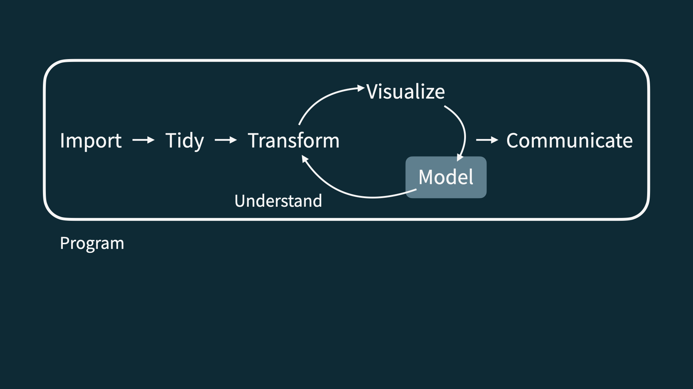
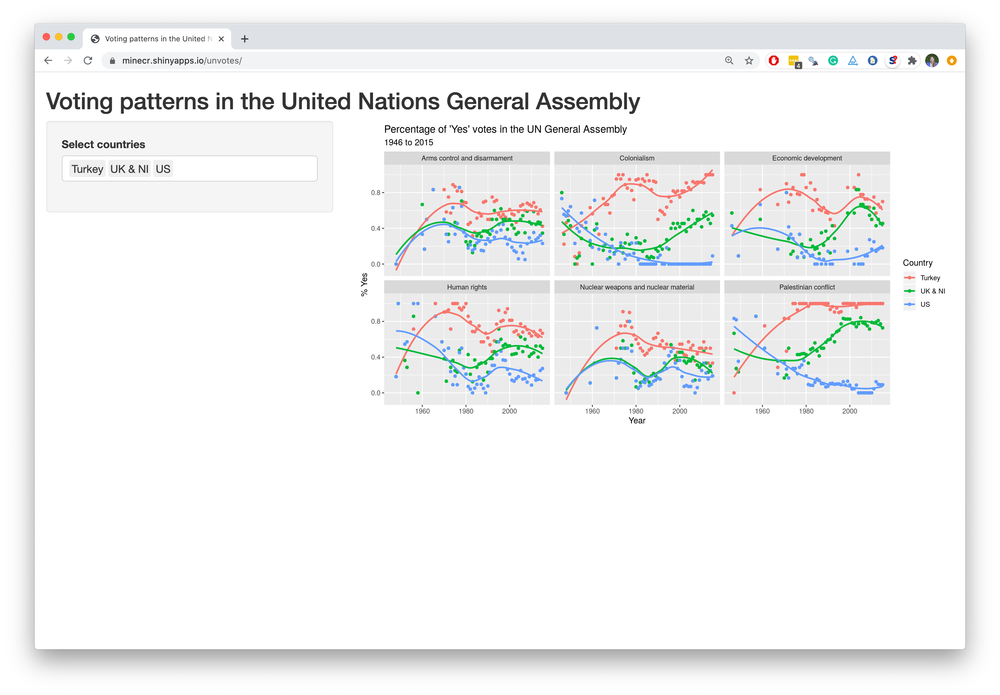

```{r child = "../setup.Rmd"}
```

```{r packages, echo=FALSE, message=FALSE, warning=FALSE, include= F}
library(tidyverse)
library(emo)
packageVersion("xaringan")
library(viridis)
library(sugrrants)
library(lubridate)
```


# Hello world!

---

class: .my-one-page-font

## Data science


.pull-left-wide[
- Data science is an exciting discipline that allows you to turn raw data into understanding, insight, and knowledge. 

- We're going to learn to do this in a `tidy` way -- more on that later!

- This is a course on introduction to data science, with an emphasis on statistical thinking.
]


---

## Course FAQ

.pull-left-wide[
**Q - What data science background does this course assume?**  
A - None.

**Q - Is this an intro stat course?**  
A - While statistics $\ne$ data science, they are very closely related and have tremendous of overlap. Hence, this course is a great way to get started with statistics. However this course is *not* your typical high school statistics course.

**Q - Will we be doing computing?**   
A - Yes.
]

---

## Course FAQ

.pull-left-wide[
**Q - Is this an intro CS course?**  
A - No, but many themes are shared.

**Q - What computing language will we learn?**  
A - R.

**Q: Why not language X?**  
A: We can discuss that over `r emo::ji("coffee")`.
]

---

class: middle

# Software

---

```{r echo=FALSE, out.width="75%", fig.align="left"}
knitr::include_graphics("img/excel.png")
```

---

```{r echo=FALSE, out.width="50%", fig.align="left"}
knitr::include_graphics("img/r.png")
```

---

```{r echo=FALSE, out.width="73%", fig.align="left"}
knitr::include_graphics("img/rstudio.png")
```

---

class: middle

# Data science life cycle

---

```{r echo=FALSE, out.width="90%", fig.align="left"}
knitr::include_graphics("img/data-science-cycle/data-science-cycle.001.png")
```

---

```{r echo=FALSE, out.width="90%", fig.align="left"}
knitr::include_graphics("img/data-science-cycle/data-science-cycle.002.png")
```

---

```{r echo=FALSE, out.width="90%", fig.align="left"}
knitr::include_graphics("img/data-science-cycle/data-science-cycle.003.png")
```

---

```{r echo=FALSE, out.width="90%", fig.align="left"}
knitr::include_graphics("img/data-science-cycle/data-science-cycle.004.png")
```

---

```{r echo=FALSE, out.width="90%", fig.align="left"}

```

---

.pull-left[
```{r echo=FALSE, out.width="90%", fig.align="left"}
knitr::include_graphics("img/data-science-cycle/data-science-cycle.006.png")
```
]
???

Let's consider an example...

---

.pull-left[
```{r echo=FALSE, out.width="90%", fig.align="left"}
knitr::include_graphics("img/data-science-cycle/data-science-cycle.006.png")
```
]
.pull-right[
```{r echo=FALSE, out.width="75%", fig.align="right"}
knitr::include_graphics("img/google-trend-index.png")
```
]
???

Google Trend Index: 
- Numerical summary of popularity of search words on Google. 
- Travel index, 2012 - 2017 and united states
- Any interesting features? 

---

.pull-left[
```{r echo=FALSE, out.width="75%", fig.align="left"}
knitr::include_graphics("img/google-trend-index.png")
```
]
.pull-right[
```{r echo=FALSE, out.width="90%", fig.align="right"}
knitr::include_graphics("img/data-science-cycle/data-science-cycle.006.png")
```

```{r echo=F}
travel <- tribble(
  ~date,              ~season,
  "23 January 2017",  "winter",
  "4 March 2017",     "spring",
  "14 June 2017",     "summer",
  "1 September 2017", "fall",
  "...", "..."
)
travel
```
]
???

- This a "snippet" of our data
- We have the exact data that each index was recorded
- Possibly what we want is to just aggregate by season and eliminating the seasonal affect to see the larger time span trend

---

```{r echo=FALSE, out.width="90%", fig.align="left"}
knitr::include_graphics("img/data-science-cycle/data-science-cycle.007.png")
```
???

The end goal: Communicating

---

```{r echo=FALSE, out.width="90%", fig.align="left"}
knitr::include_graphics("img/data-science-cycle/data-science-cycle.008.png")
```
???

This becomes a cycle - the communication/goals will often lead to changes in your model. 

---

```{r echo=FALSE, out.width="90%", fig.align="left"}
knitr::include_graphics("img/data-science-cycle/data-science-cycle.009.png")
```
???

To make this all happen: we need to program!
---

```{r echo=FALSE, out.width="85%", fig.align="left"}
knitr::include_graphics("img/unvotes/unvotes.gif")
```

???

We want to go from left to right!

---

class: middle

# Let's dive in!

---

background-image: url("img/unvotes/unvotes-01.jpeg")

???

We are going to look at United Nations General Assembly and how countries have been voting.

---

class: inverse

```{r echo=FALSE, out.width="100%", fig.align="left"}
knitr::include_graphics("img/unvotes/unvotes-02.jpeg")
```

---

class: inverse
.pull-left-wide[
```{r echo=FALSE, out.width="100%", fig.align="left"}
knitr::include_graphics("img/unvotes/unvotes-02.jpeg")
```
]
.pull-right-narrow[
- Where can we find the issues for each visualization? 
- Which countries are being visualized? 
- What is our response? What is on our y-axis? 
- What is our predictors? What is on the x-axis? 
]

---

class: inverse

```{r echo=FALSE, out.width="100%"}
knitr::include_graphics("img/unvotes/unvotes-03.jpeg")
```

---

class: inverse

```{r echo=FALSE, out.width="100%"}
knitr::include_graphics("img/unvotes/unvotes-04.jpeg")
```

---

class: inverse

```{r echo=FALSE, out.width="100%"}
knitr::include_graphics("img/unvotes/unvotes-05.jpeg")
```

???

We call each plot square a facet; this will matter to us later

---

class: inverse

```{r echo=FALSE, out.width="100%"}
knitr::include_graphics("img/unvotes/unvotes-06.jpeg")
```

???

- What do we notice about trends in Palestinian conflict or colonialism compared to the other plots when comparing countries? 
- Does this make real world sense?
- Real world vs out plots

---

class: inverse

```{r echo=FALSE, out.width="100%"}
knitr::include_graphics("img/unvotes/unvotes-07.jpeg")
```

???

- Making this vizz
- Three different data set sources

---

class: inverse

```{r echo=FALSE, out.width="90%"}
knitr::include_graphics("img/unvotes/unvotes-08.jpeg")
```

???

- We are not to coding yet!
- Notice the three dataset names are all in here

---

class: inverse

```{r echo=FALSE, out.width="90%"}
knitr::include_graphics("img/unvotes/unvotes-09.jpeg")
```

???

To get the datasets together we used "joins"

---

class: inverse

```{r echo=FALSE, out.width="90%"}
knitr::include_graphics("img/unvotes/unvotes-10.jpeg")
```

???

We then used something called "filter" and it our graph only shows data in the three countries we saw

---

class: inverse

```{r echo=FALSE, out.width="90%"}
knitr::include_graphics("img/unvotes/unvotes-11.jpeg")
```

???

- To great these plots we use something called "ggplot"
- Together we joined data, filtered countries and generated the plots

---

class: inverse

```{r echo=FALSE, out.width="90%"}
knitr::include_graphics("img/unvotes/unvotes-12.jpeg")
```

???

- Some of these terms should make sense
---

class: inverse

```{r echo=FALSE, out.width="100%"}
knitr::include_graphics("img/unvotes/unvotes-13.jpeg")
```

???

- Back to large code from earlier
- "Rmarkdown" - analysis and prose together, allows us to put text and code together

---

class: inverse

```{r echo=FALSE, out.width="100%"}
knitr::include_graphics("img/unvotes/unvotes-14.jpeg")
```

???

In an R markdown file we have some stuff at the top we need to specify. 

---

.center[
.large[
[minecr.shinyapps.io/unvotes](https://minecr.shinyapps.io/unvotes/)
]
]

```{r echo=FALSE, out.width="65%"}

```

---

## Course toolkit

<br>

.pull-left[
### .gray[Course operation]
.gray[
- Moodle
]
]
.pull-right[
### .pink[Doing data science]
- .pink[Programming:]
  - .pink[R]
  - .pink[RStudio]
  - .pink[tidyverse]
  - .pink[R Markdown]
- .gray[Version control and collaboration:]
  - .gray[Git]
  - .gray[GitHub]
]

---

## Learning goals

By the end of the course, you will be able to...

--
- use data carefully and ethically 

--
- gain insight from data

--
- gain insight from data, **reproducibly**

--
- gain insight from data, reproducibly, **using modern programming tools and techniques**

--
- gain insight from data, reproducibly **and collaboratively**, using modern programming tools and techniques

--
- gain insight from data, reproducibly **(with literate programming and version control)** and collaboratively, using modern programming tools and techniques

---

class: middle

# Reproducible data analysis

---

## Reproducibility checklist

.question[
What does it mean for a data analysis to be "reproducible"?
]

--

Near-term goals:

- Are the tables and figures reproducible from the code and data?
- Does the code actually do what you think it does?
- In addition to what was done, is it clear *why* it was done? 

Long-term goals:

- Can the code be used for other data?
- Can you extend the code to do other things?

---

## Toolkit for reproducibility

- Scriptability $\rightarrow$ R
- Literate programming (code, narrative, output in one place) $\rightarrow$ R Markdown
- Version control $\rightarrow$ Git / GitHub

---

class: middle

# R and RStudio

---

## R and RStudio

.pull-left[
```{r echo=FALSE, out.width="25%"}
knitr::include_graphics("img/r-logo.png")
```
- R is an open-source statistical **programming language**
- R is also an environment for statistical computing and graphics
- It's easily extensible with *packages*
]
.pull-right[
```{r echo=FALSE, out.width="50%"}
knitr::include_graphics("img/rstudio-logo.png")
```
- RStudio is a convenient interface for R called an **IDE** (integrated development environment), e.g. *"I write R code in the RStudio IDE"*
- RStudio is not a requirement for programming with R, but it's very commonly used by R programmers and data scientists
]

???
Joke about how not using R studio is the WORST

---

## R packages

- **Packages** are the fundamental units of reproducible R code. They include reusable R functions, the documentation that describes how to use them, and sample data<sup>1</sup>

- As of November 2021, there are over 18,000 R packages available on **CRAN** (the Comprehensive R Archive Network)<sup>2</sup>

- We're going to work with a small (but important) subset of these!

.footnote[
<sup>1</sup> Wickham and Bryan, [R Packages](https://r-pkgs.org/).

<sup>2</sup> [CRAN contributed packages](https://cran.r-project.org/web/packages/).
]

---

## Tour: R and RStudio

```{r echo=FALSE, out.width="80%"}
knitr::include_graphics("img/tour-r-rstudio.png")
```

???
Flip back to our first example to show this. 

---

## A short list (for now) of R essentials

- Functions are (most often) verbs, followed by what they will be applied to in parentheses:

```{r eval=FALSE}
do_this(to_this)
do_that(to_this, to_that, with_those)
```

--

- Packages are installed with the `install.packages` function and loaded with the `library` function, once per session:

```{r eval=FALSE}
install.packages("package_name")
library(package_name)
```

---

## R essentials (continued)

- Columns (variables) in data frames are accessed with `$`:

.small[
```{r eval=FALSE}
dataframe$var_name
```
]

--

- Object documentation can be accessed with `?`

```{r eval=FALSE}
?mean
```

---

## tidyverse

.pull-left[
```{r echo=FALSE, out.width="99%"}
knitr::include_graphics("img/tidyverse.png")
```
]

.pull-right[
.center[.large[
[tidyverse.org](https://www.tidyverse.org/)
]]

- The **tidyverse** is an opinionated collection of R packages designed for data science
- All packages share an underlying philosophy and a common grammar
]

???
Add tidymodels!

---

## rmarkdown

.pull-left[
.center[.large[
[rmarkdown.rstudio.com](https://rmarkdown.rstudio.com/)
]]

- **rmarkdown** and the various packages that support it enable R users to write their code and prose in reproducible computational documents
- We will generally refer to R Markdown documents (with `.Rmd` extension), e.g. *"Do this in your R Markdown document"* and rarely discuss loading the rmarkdown package
]

.pull-right[
```{r echo=FALSE, out.width="60%"}
knitr::include_graphics("img/rmarkdown.png")
```
]

---

class: middle

# R Markdown

---


## R Markdown

- Fully reproducible reports -- each time you knit the analysis is ran from the beginning
- Simple markdown syntax for text
- Code goes in chunks, defined by three backticks, narrative goes outside of chunks

???
Flip back to our first example to show this. 

---

## Tour: R Markdown

```{r echo=FALSE, out.width="90%"}
knitr::include_graphics("img/tour-rmarkdown.png")
```

---

## Environments

.tip[
The environment of your R Markdown document is separate from the Console!
]

Remember this, and expect it to bite you a few times as you're learning to work 
with R Markdown!

---

## Environments

.pull-left[
First, run the following in the console

.small[
```{r eval = FALSE}
x <- 2
x * 3
```
]

.question[
All looks good, eh?
]
]

--

.pull-right[
Then, add the following in an R chunk in your R Markdown document

.small[
```{r eval = FALSE}
x * 3
```
]

.question[
What happens? Why the error?
]
]

---

## R Markdown help

.pull-left[
.center[
.midi[R Markdown Cheat Sheet  
`Help -> Cheatsheets`

This Cheat Sheet (and others) will be on Moodle]
]
```{r echo=FALSE, out.width="70%"}
knitr::include_graphics("img/rmd-cheatsheet.png")
```
]
.pull-right[
.center[
.midi[Markdown Quick Reference  
`Help -> Markdown Quick Reference`

Link on Moodle and [HERE](https://web.mit.edu/r/current/RStudio/resources/markdown_help.html)]
]
```{r echo=FALSE, out.width="80%"}
knitr::include_graphics("img/md-cheatsheet.png")
```
]

---

## How will we use R Markdown?

- Every assignment / report / project / etc. is an R Markdown document
- You'll always have a template R Markdown document to start with
- The amount of scaffolding in the template will decrease over the semester

---

## What's with all the hexes?

```{r echo=FALSE, out.width="60%"}
knitr::include_graphics("img/hex-australia.png")
```

.footnote[
Mitchell O'Hara-Wild, [useR! 2018 feature wall](https://www.mitchelloharawild.com/blog/user-2018-feature-wall/)
]


## Course toolkit

<br>

.pull-left[
### .gray[Course operation]
.gray[
- Moodle
]
]
.pull-right[
### .gray[Doing data science]
- .gray[Programming:]
  - .gray[R]
  - .gray[RStudio]
  - .gray[tidyverse]
  - .gray[R Markdown]
- .pink[Version control and collaboration:]
  - .pink[Git]
  - .pink[GitHub]
]

---

class: middle

# Git and GitHub

---

## Git and GitHub

.pull-left[
```{r echo=FALSE, out.width="25%"}
knitr::include_graphics("img/git-logo.png")
```
- Git is a version control system -- like “Track Changes” features from Microsoft Word, on steroids
- It's not the only version control system, but it's a very popular one
]
.pull-right[
```{r echo=FALSE, out.width="25%"}
knitr::include_graphics("img/github-logo.png")
```
- GitHub is the home for your Git-based projects on the internet -- like DropBox but much, much better

- We will use GitHub as a platform for web hosting and collaboration (and as our course management system!)
]

---

## Versioning

```{r echo=FALSE, fig.align = "center", out.width = "70%"}
knitr::include_graphics("img/lego-steps.png")
```

---

## Versioning 

### with human readable messages

```{r echo=FALSE, fig.align = "center", out.width = "60%"}
knitr::include_graphics("img/lego-steps-commit-messages.png")
```

---

## Why do we need version control?

```{r echo=FALSE, fig.align = "center", out.width="35%"}
knitr::include_graphics("img/phd_comics_vc.gif")
```

---

## How will we use Git and GitHub?

```{r echo=FALSE, out.width="100%"}
knitr::include_graphics("img/whole-game-01.png")
```

---

## How will we use Git and GitHub?

```{r echo=FALSE, out.width="100%"}
knitr::include_graphics("img/whole-game-02.png")
```

---

## How will we use Git and GitHub?

```{r echo=FALSE, out.width="100%"}
knitr::include_graphics("img/whole-game-03.png")
```

---

## How will we use Git and GitHub?

```{r echo=FALSE, out.width="100%"}
knitr::include_graphics("img/whole-game-04.png")
```

---

# Git and GitHub tips

- There are millions of git commands -- ok, that's an exaggeration, but there are a lot of them -- and very few people know them all. 99% of the time you will use git to add, commit, push, and pull.

--
- We will be doing Git things and interfacing with GitHub through RStudio, but if you google for help you might come across methods for doing these things in the command line -- skip that and move on to the next resource unless you feel comfortable trying it out.

--
- There is a great resource for working with git and R: [happygitwithr.com](http://happygitwithr.com/). Some of the content in there is beyond the scope of this course, but it's a good place to look for help.

---

## Tour: Git and GitHub

- Create a GitHub account
- Verify your GitHub email
- Adjust your GitHub settings for a more pleasant GitHub experience
  - Settings > Emails > Uncheck "Keep my email address private"
  - Settings > Emails > Update name and photo

<br>

*Next...*

*Work with R, RStudio, Git, and GitHub together!*<sup>+</sup>

.footnote[
<sup>+</sup>Just like a real data scientist!
]


