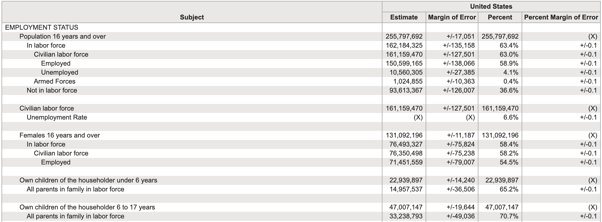
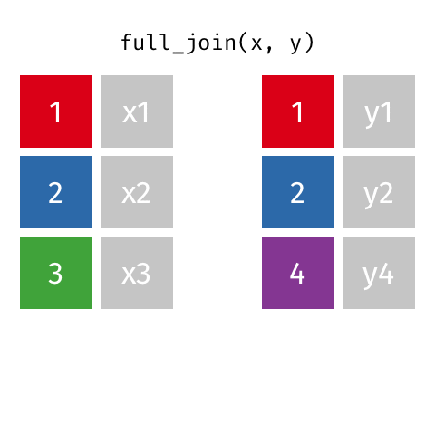
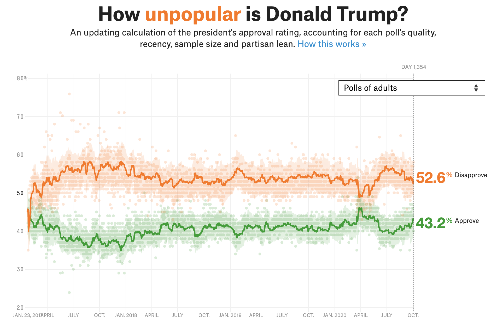

```{r child = "../setup.Rmd"}
```

```{r packages, echo=FALSE, message=FALSE, warning=FALSE}
library(tidyverse)
library(knitr)
options(
  dplyr.print_min = 10, 
  dplyr.print_max = 10
  )
```

## Tidy data

>Happy families are all alike; every unhappy family is unhappy in its own way. 
>
>Leo Tolstoy

--

.pull-left[
**Characteristics of tidy data:**

- Each variable forms a column.
- Each observation forms a row.
- Each type of observational unit forms a table.
]
--
.pull-right[
**Characteristics of untidy data:**

!@#$%^&*()
]

---

## 

.question[
What makes this data not tidy?
]

```{r hyperwar-airplanes-on-hand, echo=FALSE, out.width="90%", fig.align = "center", caption = "WW2 Army Air Force combat aircraft", out.width = "70%"}
knitr::include_graphics("img/hyperwar-airplanes-on-hand.png")
```

.footnote[
Source: [Army Air Forces Statistical Digest, WW II](https://www.ibiblio.org/hyperwar/AAF/StatDigest/aafsd-3.html)
]

---

.question[
What makes this data not tidy?
]

<br>

```{r hiv-est-prevalence-15-49, echo=FALSE, out.width="95%", fig.align = "center", caption = "Estimated HIV prevalence among 15-49 year olds", out.width = "70%"}
knitr::include_graphics("img/hiv-est-prevalence-15-49.png")
```

.footnote[
Source: [Gapminder, Estimated HIV prevalence among 15-49 year olds](https://www.gapminder.org/data)
]

---

.question[
What makes this data not tidy?
]

<br>

```{r us-general-economic-characteristic-acs-2017, echo=FALSE, out.width="95%", fig.align = "center", caption = "US General Economic Characteristics, ACS 2017", out.width = "85%"}

```

.footnote[
Source: [US Census Fact Finder, General Economic Characteristics, ACS 2017](https://factfinder.census.gov/faces/tableservices/jsf/pages/productview.xhtml?pid=ACS_17_5YR_DP03&src=pt)
]

---

## Displaying vs. summarising data

.panelset[

.panel[.panel-name[Output]

.pull-left[
```{r echo=FALSE}
starwars %>%
  select(name, height, mass)
```
]
.pull-right[
```{r echo=FALSE}
starwars %>%
  group_by(gender) %>%
  summarize(avg_ht = mean(height, na.rm = TRUE))
```
]

]

.panel[.panel-name[Code]

.pull-left[
```{r eval=FALSE}
starwars %>%
  select(name, height, mass)
```
]
.pull-right[
```{r eval=FALSE}
starwars %>%
  group_by(gender) %>%
  summarize(
    avg_ht = mean(height, na.rm = TRUE)
    )
```
]

]

]

---

class: middle

# Grammar of data wrangling

---

## A grammar of data wrangling...

... based on the concepts of functions as verbs that manipulate data frames

.pull-left[
```{r dplyr-part-of-tidyverse, echo=FALSE, out.width="70%", caption = "dplyr is part of the tidyverse"}
knitr::include_graphics("img/dplyr-part-of-tidyverse.png")
```
]
.pull-right[
.midi[
- `select`: pick columns by name
- `arrange`: reorder rows
- `slice`: pick rows using index(es)
- `filter`: pick rows matching criteria
- `distinct`: filter for unique rows
- `mutate`: add new variables
- `summarise`: reduce variables to values
- `group_by`: for grouped operations
- ... (many more)
]
]

---

## Rules of **dplyr** functions

- First argument is *always* a data frame
- Subsequent arguments say what to do with that data frame
- Always return a data frame
- Don't modify in place

---

## Data: Hotel bookings

- Data from two hotels: one resort and one city hotel
- Observations: Each row represents a hotel booking
- Goal for original data collection: Development of prediction models to classify a hotel booking's likelihood to be cancelled ([Antonia et al., 2019](https://www.sciencedirect.com/science/article/pii/S2352340918315191#bib5))

```{r message=FALSE}
hotels <- read_csv("data/hotels.csv")
```

.footnote[
Source: [TidyTuesday](https://github.com/rfordatascience/tidytuesday/blob/master/data/2020/2020-02-11/readme.md)
]

---

## First look: Variables

```{r output.lines=18}
names(hotels)
```

---

## Second look: Overview

```{r output.lines=18}
glimpse(hotels)
```

---

## Select a single column

View only `lead_time` (number of days between booking and arrival date):

```{r}
select(hotels, lead_time)
```

---

## Select a single column

.pull-left[
```{r eval=FALSE}
select( #<<
  hotels, 
  lead_time
  )
```
]
.pull-right[
- Start with the function (a verb): `select()`
]

---

## Select a single column

.pull-left[
```{r eval=FALSE}
select( 
  hotels, #<<
  lead_time
  )
```
]
.pull-right[
- Start with the function (a verb): `select()`
- First argument: data frame we're working with , `hotels`
]

---

## Select a single column

.pull-left[
```{r eval=FALSE}
select( 
  hotels, 
  lead_time #<<
  )
```
]
.pull-right[
- Start with the function (a verb): `select()`
- First argument: data frame we're working with , `hotels`
- Second argument: variable we want to select, `lead_time`
]

---

## Select a single column

.pull-left[
```{r}
select( 
  hotels, 
  lead_time
  )
```
]
.pull-right[
- Start with the function (a verb): `select()`
- First argument: data frame we're working with , `hotels`
- Second argument: variable we want to select, `lead_time`
- Result: data frame with `r nrow(hotels)` rows and 1 column
]

---

.tip[
dplyr functions always expect a data frame and always yield a data frame.
]

```{r}
select(hotels, lead_time)
```

---

## Select multiple columns


View only the `hotel` type and `lead_time`:

--

.pull-left[
```{r}
select(hotels, hotel, lead_time)
```
]
--
.pull-right[
.question[
What if we wanted to select these columns, and then arrange the data in descending order of lead time?
]
]

---

## Data wrangling, step-by-step

.pull-left[
Select:
```{r}
hotels %>%
  select(hotel, lead_time)
```
]

--
.pull-right[
Select, then arrange:
```{r}
hotels %>%
  select(hotel, lead_time) %>%
  arrange(desc(lead_time))
```
]

---

class: middle

# Pipes

---

## What is a pipe?

In programming, a pipe is a technique for passing information from one process to another.

--

.pull-left[
- Start with the data frame `hotels`, and pass it to the `select()` function,
]
.pull-right[
.midi[
```{r}
hotels %>% #<<
  select(hotel, lead_time) %>%
  arrange(desc(lead_time))
```
]
]

---

## What is a pipe?

In programming, a pipe is a technique for passing information from one process to another.

.pull-left[
- Start with the data frame `hotels`, and pass it to the `select()` function,
- then we select the variables `hotel` and `lead_time`,
]
.pull-right[
.midi[
```{r}
hotels %>%
  select(hotel, lead_time) %>% #<<
  arrange(desc(lead_time))
```
]
]

---

## What is a pipe?

In programming, a pipe is a technique for passing information from one process to another.

.pull-left[
- Start with the data frame `hotels`, and pass it to the `select()` function,
- then we select the variables `hotel` and `lead_time`,
- and then we arrange the data frame by `lead_time` in descending order.
]
.pull-right[
.midi[
```{r}
hotels %>%
  select(hotel, lead_time) %>% 
  arrange(desc(lead_time)) #<<
```
]
]

---

## Aside

The pipe operator is implemented in the package **magrittr**, though we don't need to load this package explicitly since **tidyverse** does this for us.

--

.question[
Any guesses as to why the package is called magrittr?
]

--

.pull-left[
```{r magritte, echo=FALSE, out.width="90%", caption = "Magritte's pipe"}
knitr::include_graphics("img/magritte.jpg")
```
]
.pull-right[
```{r magrittr, echo=FALSE, out.width="100%", caption = "magrittr's pipe"}
knitr::include_graphics("img/magrittr.jpg")
```
]

???

[explanation](https://cran.r-project.org/web/packages/magrittr/vignettes/magrittr.html)


---

## How does a pipe work?

- You can think about the following sequence of actions - find keys, 
unlock car, start car, drive to work, park.

--
- Expressed as a set of nested functions in R pseudocode this would look like:
```{r eval=FALSE}
park(drive(start_car(find("keys")), to = "work"))
```

--
- Writing it out using pipes give it a more natural (and easier to read) 
structure:
```{r eval=FALSE}
find("keys") %>%
  start_car() %>%
  drive(to = "work") %>%
  park()
```

---

## A note on piping and layering

- `%>%` used mainly in **dplyr** pipelines, *we pipe the output of the previous line of code as the first input of the next line of code*

--
- `+` used in **ggplot2** plots is used for "layering", *we create the plot in layers, separated by `+`*

---

## dplyr

.midi[
`r emo::ji("x")`

```{r error=TRUE}
hotels +
  select(hotel, lead_time)
```

`r emo::ji("white_check_mark")`

```{r eval=FALSE}
hotels %>%
  select(hotel, lead_time)
```

```{r echo=FALSE, output.lines=6}
hotels %>%
  select(hotel, lead_time)
```
]

---

## ggplot2

.midi[
`r emo::ji("x")`

```{r error=TRUE}
ggplot(hotels, aes(x = hotel, fill = deposit_type)) %>%
  geom_bar()
```

`r emo::ji("white_check_mark")`

```{r out.width="25%"}
ggplot(hotels, aes(x = hotel, fill = deposit_type)) +
  geom_bar()
```
]

---

## Code styling

Many of the styling principles are consistent across `%>%` and `+`:

- always a space before
- always a line break after (for pipelines with more than 2 lines)

`r emo::ji("x")`

```{r eval=FALSE}
ggplot(hotels,aes(x=hotel,y=deposit_type))+geom_bar()
```

`r emo::ji("white_check_mark")`

```{r eval=FALSE}
ggplot(hotels, aes(x = hotel, y = deposit_type)) + 
  geom_bar()
```

# .hand[We...]

.huge[.green[have]] .hand[a single data frame]

.huge[.pink[want]] .hand[to slice it, and dice it, and juice it, and process it]

---

## Data: Hotel bookings

- Data from two hotels: one resort and one city hotel
- Observations: Each row represents a hotel booking

```{r message=FALSE}
hotels <- read_csv("data/hotels.csv")
```

---

class: middle

# `select`, `arrange`, and `slice`

---

## `select` to keep variables

```{r}
hotels %>%
  select(hotel, lead_time) #<<
```

---

## `select` to exclude variables

.small[
```{r output.lines=18}
hotels %>%
  select(-agent) #<<
```
]

---

## `select` a range of variables

```{r}
hotels %>%
  select(hotel:arrival_date_month) #<<
```

---

## `select` variables with certain characteristics

```{r}
hotels %>%
  select(starts_with("arrival")) #<<
```

---

## `select` variables with certain characteristics

```{r}
hotels %>%
  select(ends_with("type")) #<<
```

---

## Select helpers

- `starts_with()`: Starts with a prefix
- `ends_with()`: Ends with a suffix
- `contains()`: Contains a literal string
- `num_range()`: Matches a numerical range like x01, x02, x03
- `one_of()`: Matches variable names in a character vector
- `everything()`: Matches all variables
- `last_col()`: Select last variable, possibly with an offset
- `matches()`: Matches a regular expression (a sequence of symbols/characters expressing a string/pattern to be searched for within text)

.footnote[
See help for any of these functions for more info, e.g. `?everything`.
]

---

## `arrange` in ascending / descending order

.pull-left[
```{r}
hotels %>%
  select(adults, children, babies) %>%
  arrange(babies) #<<
```
]
.pull-right[
```{r}
hotels %>%
  select(adults, children, babies) %>%
  arrange(desc(babies)) #<<
```
]

---

## `slice` for certain row numbers

.midi[
```{r output.lines=17}
# first five
hotels %>%
  slice(1:5) #<<
```
]

---

.tip[
In R, you can use the `#` for adding comments to your code. 
Any text following `#` will be printed as is, and won't be run as R code.
This is useful for leaving comments in your code and for temporarily disabling 
certain lines of code while debugging.
]

.small[
```{r output.lines=10}
hotels %>%
  # slice the first five rows  # this line is a comment
  #select(hotel) %>%           # this one doesn't run
  slice(1:5)                   # this line runs
```
]

---

class: middle

# `filter`

---

## `filter` to select a subset of rows

.midi[
```{r output.lines=17}
# bookings in City Hotels
hotels %>%
  filter(hotel == "City Hotel") #<<
```
]

---

## `filter` for many conditions at once

```{r}
hotels %>%
  filter( 
    adults == 0,     #<<
    children >= 1    #<<
    ) %>% 
  select(adults, babies, children)
```

---

## `filter` for more complex conditions

```{r}
# bookings with no adults and some children or babies in the room
hotels %>%
  filter( 
    adults == 0,     
    children >= 1 | babies >= 1     # | means or  #<<
    ) %>%
  select(adults, babies, children)
```

---

## Logical operators in R

<br>

operator    | definition                   || operator     | definition
------------|------------------------------||--------------|----------------
`<`         | less than                    ||`x`&nbsp;&#124;&nbsp;`y`     | `x` OR `y` 
`<=`        |	less than or equal to        ||`is.na(x)`    | test if `x` is `NA`
`>`         | greater than                 ||`!is.na(x)`   | test if `x` is not `NA`
`>=`        |	greater than or equal to     ||`x %in% y`    | test if `x` is in `y`
`==`        |	exactly equal to             ||`!(x %in% y)` | test if `x` is not in `y`
`!=`        |	not equal to                 ||`!x`          | not `x`
`x & y`     | `x` AND `y`                  ||              |

---

.your-turn[
### Your turn!

Time to actually play around with the Hotels dataset!

- Go to RStudio and start `AE 04 - Hotels + Data wrangling`.
- Open the R Markdown document and complete Exercises 1 - 4.
]

---

class: middle

# `distinct` and `count`

---

```{r include=FALSE}
options(dplyr.print_max = 20)
```


## `distinct` to filter for unique rows

... and `arrange` to order alphabetically

.small[
.pull-left[
```{r}
hotels %>% 
  distinct(market_segment) %>% #<<
  arrange(market_segment)
```
]
.pull-right[
```{r output.lines=13}
hotels %>% 
  distinct(hotel, market_segment) %>% #<<
  arrange(hotel, market_segment)
```
]
]

---

## `count` to create frequency tables

.pull-left[
```{r}
# alphabetical order by default
hotels %>%
  count(market_segment) #<<
```
]
--
.pull-right[
```{r}
# descending frequency order
hotels %>%
  count(market_segment, sort = TRUE) #<<
```
]

---

## `count` and `arrange`

.pull-left[
```{r}
# ascending frequency order
hotels %>%
  count(market_segment) %>%
  arrange(n) #<<
```
]
.pull-right[
```{r}
# descending frequency order
# just like adding sort = TRUE
hotels %>%
  count(market_segment) %>%
  arrange(desc(n)) #<<
```
]

---

## `count` for multiple variables

```{r}
hotels %>%
  count(hotel, market_segment) #<<
```

---

## order matters when you `count`

.midi[
.pull-left[
```{r}
# hotel type first
hotels %>%
  count(hotel, market_segment) #<<
```
]
.pull-right[
```{r}
# market segment first
hotels %>%
  count(market_segment, hotel) #<<
```
]
]

---

.your-turn[
### Your turn!

- Go back to RStudio and continue `AE 04 - Hotels + Data wrangling`.
- Open the R Markdown document and complete Exercises 5 and 6.
]

---

class: middle

# `mutate`

---

## `mutate` to add a new variable

```{r}
hotels %>%
  mutate(little_ones = children + babies) %>% #<<
  select(children, babies, little_ones) %>%
  arrange(desc(little_ones))
```

---

## Little ones in resort and city hotels

.midi[
.pull-left[
```{r}
# Resort Hotel
hotels %>%
  mutate(little_ones = children + babies) %>%
  filter(
    little_ones >= 1,
    hotel == "Resort Hotel"
    ) %>%
  select(hotel, little_ones)
```
]
.pull-right[
```{r}
# City Hotel
hotels %>%
  mutate(little_ones = children + babies) %>%
  filter(
    little_ones >= 1,
    hotel == "City Hotel"
    )  %>%
  select(hotel, little_ones)
```
]
]

---

.question[
What is happening in the following chunk?
]

.midi[
```{r}
hotels %>%
  mutate(little_ones = children + babies) %>%
  count(hotel, little_ones) %>%
  mutate(prop = n / sum(n))
```
]

---

class: middle

# `summarise` and `group_by`

---

## `summarise` for summary stats

```{r}
# mean average daily rate for all bookings
hotels %>%
  summarise(mean_adr = mean(adr)) #<<
```

--

.pull-left-wide[
.tip[
`summarise()` changes the data frame entirely, it collapses rows down to a single 
summary statistic, and removes all columns that are irrelevant to the calculation.
]
]

---

.tip[
`summarise()` also lets you get away with being sloppy and not naming your new 
column, but that's not recommended!
]

.pull-left[
`r emo::ji("x")`

```{r}
hotels %>%
  summarise(mean(adr))
```
]
.pull-right[
`r emo::ji("white_check_mark")`

```{r}
hotels %>%
  summarise(mean_adr = mean(adr))
```
]

---

## `group_by` for grouped operations

```{r}
# mean average daily rate for all booking at city and resort hotels
hotels %>%
  group_by(hotel) %>% #<<
  summarise(mean_adr = mean(adr))
```

---

## Calculating frequencies

The following two give the same result, so `count` is simply short for `group_by` then determine frequencies 

.pull-left[
```{r}
hotels %>%
  group_by(hotel) %>%
  summarise(n = n())
```
]
.pull-right[
```{r}
hotels %>%
  count(hotel)
```
]

---

## Multiple summary statistics

`summarise` can be used for multiple summary statistics as well

```{r}
hotels %>%
  summarise(
    min_adr = min(adr),
    mean_adr = mean(adr),
    median_adr = median(adr),
    max_adr = max(adr)
    )
```

---

.your-turn[
### Your turn!

Time to actually play around with the Hotels dataset!

- Go to RStudio and start `AE 04 - Hotels + Data wrangling`.
- Open the R Markdown document and complete Exercises 7 and 8.
]

---

# .hand[We...]

.huge[.green[have]] .hand[multiple data frames]

.huge[.pink[want]] .hand[to bring them together]

---

```{r include=FALSE}
professions <- read_csv("data/scientists/professions.csv")
dates <- read_csv("data/scientists/dates.csv")
works <- read_csv("data/scientists/works.csv")
```

## Data: Women in science 

Information on 10 women in science who changed the world

.small[
```{r echo=FALSE}
professions %>% select(name) %>% kable()
```
]


.footnote[
Source: [Discover Magazine](https://www.discovermagazine.com/the-sciences/meet-10-women-in-science-who-changed-the-world)
]

---

## Inputs

.panelset[

.panel[.panel-name[professions]
```{r}
professions
```
]

.panel[.panel-name[dates]
```{r}
dates
```
]

.panel[.panel-name[works]
```{r}
works
```
]

]

---

## Desired output

```{r echo=FALSE}
professions %>%
  left_join(dates) %>%
  left_join(works)
```

---

## Inputs, reminder

.pull-left[
```{r}
names(professions)
names(dates)
names(works)
```
]
.pull-right[
```{r}
nrow(professions)
nrow(dates)
nrow(works)
```
]

---

class: middle

# Joining data frames

---

## Joining data frames

```{r eval=FALSE}
something_join(x, y)
```

- `left_join()`: all rows from x
- `right_join()`: all rows from y
- `full_join()`: all rows from both x and y
- `semi_join()`: all rows from x where there are matching values in y, keeping just columns from x
- `inner_join()`: all rows from x where there are matching values in y, return 
all combination of multiple matches in the case of multiple matches
- `anti_join()`: return all rows from x where there are not matching values in y, never duplicate rows of x
- ...
 
---

## Setup

For the next few slides...

.pull-left[
```{r echo=FALSE}
x <- tibble(
  id = c(1, 2, 3),
  value_x = c("x1", "x2", "x3")
  )
```
```{r}
x
```
]
.pull-right[
```{r echo=FALSE}
y <- tibble(
  id = c(1, 2, 4),
  value_y = c("y1", "y2", "y4")
  )
```
```{r}
y
```
]

---

## `left_join()`

.pull-left[
```{r echo=FALSE, out.width="80%", out.extra ='style="background-color: #FDF6E3"'}
include_graphics("img/left-join.gif")
```
]
.pull-right[
```{r}
left_join(x, y)
```
]

---

## `left_join()`

```{r}
professions %>%
  left_join(dates) #<<
```

---

## `right_join()`

.pull-left[
```{r echo=FALSE, out.width="80%", out.extra ='style="background-color: #FDF6E3"'}
include_graphics("img/right-join.gif")
```
]
.pull-right[
```{r}
right_join(x, y)
```
]

---

## `right_join()`


```{r}
professions %>%
  right_join(dates) #<<
```

---

## `full_join()`

.pull-left[
```{r echo=FALSE, out.width="80%", out.extra ='style="background-color: #FDF6E3"'}

```
]
.pull-right[
```{r}
full_join(x, y)
```
]

---

## `full_join()`

```{r}
dates %>%
  full_join(works) #<<
```

---

## `inner_join()`

.pull-left[
```{r echo=FALSE, out.width="80%", out.extra ='style="background-color: #FDF6E3"'}
include_graphics("img/inner-join.gif")
```
]
.pull-right[
```{r}
inner_join(x, y)
```
]

---

## `inner_join()`

```{r}
dates %>%
  inner_join(works) #<<
```

---

## `semi_join()`

.pull-left[
```{r echo=FALSE, out.width="80%", out.extra ='style="background-color: #FDF6E3"'}
include_graphics("img/semi-join.gif")
```
]
.pull-right[
```{r}
semi_join(x, y)
```
]

---

## `semi_join()`

```{r}
dates %>%
  semi_join(works) #<<
```

---

## `anti_join()`

.pull-left[
```{r echo=FALSE, out.width="80%", out.extra ='style="background-color: #FDF6E3"'}
include_graphics("img/anti-join.gif")
```
]
.pull-right[
```{r}
anti_join(x, y)
```
]

---

## `anti_join()`

```{r}
dates %>%
  anti_join(works) #<<
```

---

## Putting it altogether

```{r}
professions %>%
  left_join(dates) %>%
  left_join(works)
```

---

class: middle

# Case study: Student records

---

## Student records

- Have:
  - Enrolment: official university enrolment records
  - Survey: Student provided info missing students who never filled it out and including students who filled it out but dropped the class
- Want: Survey info for all enrolled in class 

--

```{r include=FALSE}
enrolment <- read_csv("data/students/enrolment.csv")
survey <- read_csv("data/students/survey.csv")
```

.pull-left[
```{r message = FALSE}
enrolment
```
]
.pull-right[
```{r message = FALSE}
survey
```
]

---

## Student records

.panelset[

.panel[.panel-name[In class]
```{r}
enrolment %>% 
  left_join(survey, by = "id") #<<
```
]

.panel[.panel-name[Survey missing]
```{r}
enrolment %>% 
  anti_join(survey, by = "id") #<<
```
]

.panel[.panel-name[Dropped]
```{r}
survey %>% 
  anti_join(enrolment, by = "id") #<<
```
]

]

---

class: middle

# Case study: Grocery sales

---

## Grocery sales

- Have:
  - Purchases: One row per customer per item, listing purchases they made
  - Prices: One row per item in the store, listing their prices
- Want: Total revenue

--

```{r include=FALSE}
purchases <- read_csv("data/sales/purchases.csv")
prices <- read_csv("data/sales/prices.csv")
```

.pull-left[
```{r message = FALSE}
purchases
```
]
.pull-right[
```{r message = FALSE}
prices
```
]

---

## Grocery sales

.panelset[

.panel[.panel-name[Total revenue]
.pull-left[
```{r}
purchases %>% 
  left_join(prices) #<<
```
]
.pull-right[
```{r}
purchases %>% 
  left_join(prices) %>%
  summarise(total_revenue = sum(price)) #<<
```
]
]

.panel[.panel-name[Revenue per customer]

.pull-left[
```{r}
purchases %>% 
  left_join(prices)
```
]
.pull-right[
```{r}
purchases %>% 
  left_join(prices) %>%
  group_by(customer_id) %>% #<<
  summarise(total_revenue = sum(price))
```
]

]

]

---

# .hand[We...]

.huge[.green[have]] .hand[data organised in an unideal way for our analysis]

.huge[.pink[want]] .hand[to reorganise the data to carry on with our analysis]

---

## Data: Sales

```{r include=FALSE}
customers <- read_csv("data/sales/customers.csv")
prices <- read_csv("data/sales/prices.csv")
```


<br>

.pull-left[
### .green[We have...]
```{r echo=FALSE}
customers
```
]

--
.pull-right[
### .pink[We want...]
```{r echo=FALSE}
customers %>%
  pivot_longer(cols = item_1:item_3, names_to = "item_no", values_to = "item")
```
]

---

## A grammar of data tidying

.pull-left[
```{r dplyr-part-of-tidyverse2, echo=FALSE, out.width="60%", caption = "tidyr is part of the tidyverse"}

```
]
.pull-right[
The goal of tidyr is to help you tidy your data via

- pivoting for going between wide and long data
- splitting and combining character columns
- nesting and unnesting columns
- clarifying how `NA`s should be treated
]

---

class: middle

# Pivoting data

---

## Not this...

```{r echo=FALSE,out.width="70%"}
include_graphics("img/pivot.gif")
```

---

## but this!

.center[
```{r echo=FALSE, out.width="45%", out.extra ='style="background-color: #FDF6E3"'}
include_graphics("img/tidyr-longer-wider.gif")
```
]

---

## Wider vs. longer

.pull-left[
### .green[wider]
more columns
```{r echo=FALSE}
customers
```
]

--
.pull-right[
### .pink[longer]
more rows
```{r echo=FALSE}
customers %>%
  pivot_longer(cols = item_1:item_3, names_to = "item_no", values_to = "item")
```
]

---

## `pivot_longer()`

.pull-left[
- `data` (as usual)
]
.pull-right[
```{r eval=FALSE}
pivot_longer(
  data, #<<
  cols, 
  names_to = "name", 
  values_to = "value"
  )
```
]

---

## `pivot_longer()`

.pull-left[
- `data` (as usual)
- `cols`: columns to pivot into longer format 
]
.pull-right[
```{r eval=FALSE}
pivot_longer(
  data, 
  cols, #<<
  names_to = "name", 
  values_to = "value"
  )
```
]

---

## `pivot_longer()`

.pull-left[
- `data` (as usual)
- `cols`: columns to pivot into longer format 
- `names_to`: name of the column where column names of pivoted variables go (character string)
]
.pull-right[
```{r eval=FALSE}
pivot_longer(
  data, 
  cols, 
  names_to = "name", #<<
  values_to = "value"
  )
```
]

---

## `pivot_longer()`

.pull-left[
- `data` (as usual)
- `cols`: columns to pivot into longer format 
- `names_to`: name of the column where column names of pivoted variables go (character string)
- `values_to`: name of the column where data in pivoted variables go (character string)
]
.pull-right[
```{r eval=FALSE}
pivot_longer(
  data, 
  cols, 
  names_to = "name", 
  values_to = "value" #<<
  )
```
]

---

## Customers $\rightarrow$ purchases

```{r}
purchases <- customers %>%
  pivot_longer( #<<
    cols = item_1:item_3,  # variables item_1 to item_3 #<<
    names_to = "item_no",  # column names -> new column called item_no #<<
    values_to = "item"     # values in columns -> new column called item #<<
    ) #<<

purchases
```

---

## Why pivot?

Most likely, because the next step of your analysis needs it

--

.pull-left[
```{r}
prices
```
]
.pull-right[
```{r}
purchases %>%
  left_join(prices) #<<
```
]

---

## Purchases $\rightarrow$ customers

.pull-left-narrow[
- `data` (as usual)
- `names_from`: which column in the long format contains the what should be column names in the wide format
- `values_from`: which column in the long format contains the what should be values in the new columns in the wide format
]
.pull-right-wide[
```{r}
purchases %>%
  pivot_wider( #<<
    names_from = item_no, #<<
    values_from = item #<<
  ) #<<
```
]

---

class: middle

# Case study: Approval rating of Donald Trump

---

```{r echo=FALSE, out.width="70%"}

```

.footnote[
Source: [FiveThirtyEight](https://projects.fivethirtyeight.com/trump-approval-ratings/adults/)
]

---

## Data

```{r include=FALSE}
trump <- read_csv("data/trump/trump.csv")
```

```{r}
trump
```

---

## Goal

.pull-left-wide[
```{r echo=FALSE, out.width="100%"}
trump %>%
  pivot_longer(
    cols = c(approval, disapproval),
    names_to = "rating_type",
    values_to = "rating_value"
  ) %>%
  ggplot(aes(x = date, y = rating_value, 
             color = rating_type, group = rating_type)) +
  geom_line() +
  facet_wrap(~ subgroup) +
  scale_color_manual(values = c("darkgreen", "orange")) + 
  labs( 
    x = "Date", y = "Rating", 
    color = NULL, 
    title = "How (un)popular is Donald Trump?", 
    subtitle = "Estimates based on polls of all adults and polls of likely/registered voters", 
    caption = "Source: FiveThirtyEight modeling estimates" 
  ) + 
  theme_minimal() +
  theme(legend.position = "bottom")
```
]
--
.pull-right-narrow[
**Aesthetic mappings:**  
`r emo::ji("check")`  x = `date`  
`r emo::ji("x")`      y = `rating_value`  
`r emo::ji("x")`      color = `rating_type`

**Facet:**  
`r emo::ji("check")`  `subgroup` (Adults and Voters)
]

???

When the data was graphed it requires adding multiple lines with the different columns as different data values. 

This insn't ideal, imagine if you had 5 categories, you would need five different gglines() calls in the ggplot. And this is non standard.


---

## Pivot

```{r output.lines=11}
trump_longer <- trump %>%
  pivot_longer(
    cols = c(approval, disapproval),
    names_to = "rating_type",
    values_to = "rating_value"
  )

trump_longer
```

---

## Plot

```{r fig.asp = 0.5}
ggplot(trump_longer, 
       aes(x = date, y = rating_value, color = rating_type, group = rating_type)) +
  geom_line() +
  facet_wrap(~ subgroup)
```

---

.panelset[

.panel[.panel-name[Code]
```{r "trump-plot", fig.show="hide"}
ggplot(trump_longer, 
       aes(x = date, y = rating_value, 
           color = rating_type, group = rating_type)) +
  geom_line() +
  facet_wrap(~ subgroup) +
  scale_color_manual(values = c("darkgreen", "orange")) + #<<
  labs( #<<
    x = "Date", y = "Rating", #<<
    color = NULL, #<<
    title = "How (un)popular is Donald Trump?", #<<
    subtitle = "Estimates based on polls of all adults and polls of likely/registered voters", #<<
    caption = "Source: FiveThirtyEight modeling estimates" #<<
  ) #<<
```
]

.panel[.panel-name[Plot]
```{r ref.label="trump-plot", echo = FALSE, out.width="75%"}
```
]

]

---

.panelset[

.panel[.panel-name[Code]
```{r "trump-plot-2", fig.show="hide"}
ggplot(trump_longer, 
       aes(x = date, y = rating_value, 
           color = rating_type, group = rating_type)) +
  geom_line() +
  facet_wrap(~ subgroup) +
  scale_color_manual(values = c("darkgreen", "orange")) + 
  labs( 
    x = "Date", y = "Rating", 
    color = NULL, 
    title = "How (un)popular is Donald Trump?", 
    subtitle = "Estimates based on polls of all adults and polls of likely/registered voters", 
    caption = "Source: FiveThirtyEight modeling estimates" 
  ) + 
  theme_minimal() + #<<
  theme(legend.position = "bottom") #<<
```
]

.panel[.panel-name[Plot]
```{r ref.label="trump-plot-2", echo = FALSE, out.width="75%", fig.width=6}
```
]

]

