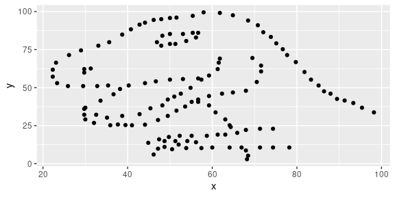

Lab 01 - Hello R
================
Tyler George
11/11/2021

## Load packages and data

``` r
library(tidyverse) 
library(datasauRus)
library(usethis)
```

## Connecting RStudio and Github Code:

### Step 1

``` r
usethis::create_github_token()
```

    ## • Call `gitcreds::gitcreds_set()` to register this token in the local Git credential store
    ##   It is also a great idea to store this token in any password-management software that you use

    ## • Open URL 'https://github.com/settings/tokens/new?scopes=repo,user,gist,workflow&description=DESCRIBE THE TOKEN\'S USE CASE'

### Step 6

GITHUB_PAT=

### Step 7

``` r
gitcreds::gitcreds_set() #Tells R to save your PAT to your RStudio user
```

### Step 8

``` r
usethis::edit_r_environ()
```

## Exercises

### Exercise 1

Remove this text, and add your answer for Exercise 1 here.

### Exercise 2

The answers for this Exercise are given for you below. But you should
clean up some of the narrative so that it only includes what you want to
turn in.

First let’s plot the data in the dino dataset:

``` r
dino_data <- datasaurus_dozen %>%
  filter(dataset == "dino")

ggplot(data = dino_data, mapping = aes(x = x, y = y)) +
  geom_point()
```

<!-- -->

And next calculate the correlation between `x` and `y` in this dataset:

``` r
dino_data %>%
  summarize(r = cor(x, y))
```

    ## # A tibble: 1 × 1
    ##         r
    ##     <dbl>
    ## 1 -0.0645

### Exercise 3

Add code and narrative as needed. Note that the R chunks are labelled
with `plot-star` and `cor-star` to provide spaces to place the code for
plotting and calculating the correlation coefficient. To finish, clean
up the narrative by removing these instructions.

Blah blah blah…

I’m some text, you should replace me with more meaningful text…

### Exercise 4

Add code and narrative as needed. Note that two R chunks are given but
they are not labeled. Use the convention from above to name them
appropriately.

### Exercise 5

Add code and narrative as needed. To add R chunks either type out the
backticks, curly braces, and the letter `r` or use the Insert chunk
button above, green C+.
