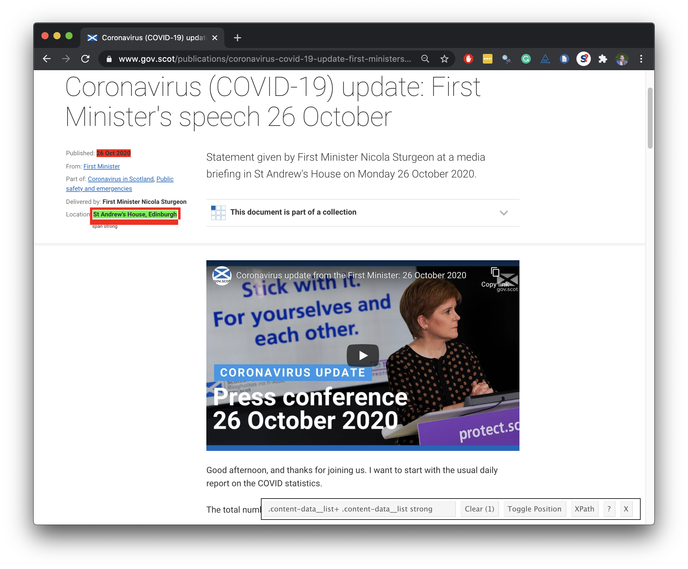

```{r child = "../setup.Rmd"}
```

```{r packages, echo = FALSE, message=FALSE, warning=FALSE}
library(tidyverse)
library(rvest)
library(DT)
library(lubridate)
```

class: middle

# First Minister's COVID speeches

---

## 🏁 Start with

```{r echo=FALSE, out.width="75%"}
knitr::include_graphics("img/fm-speeches.png")
```

---

## End with 🛑

```{r echo=FALSE}
covid_speeches <- read_rds("data/covid-speeches-scot.rds") %>%
  print(n = 15)
```


---

#### .center[
[www.gov.scot/collections/first-ministers-speeches](https://www.gov.scot/collections/first-ministers-speeches/)
]

```{r echo=FALSE, out.width="75%"}
knitr::include_graphics("img/fm-speeches-annotated.png")
```

---

```{r echo=FALSE, out.width="65%"}
knitr::include_graphics("img/fm-speech-oct-26-annotated.png")
```

---

## Plan

1. Scrape `title`, `date`, `location`, `abstract`, and `text` from a few COVID-19 speech pages to develop the code

2. Write a function that scrapes `title`, `date`, `location`, `abstract`, and `text` from COVID-19 speech pages

3. Scrape the `url`s of COVID-19 speeches from the main page

4. Use this function to scrape from each individual COVID-19 speech from these `url`s and create a data frame with the columns `title`, `date`, `location`, `abstract`, `text`, and `url`

---

class: middle

# Scrape data from a few COVID-19 speech pages

---

## Read page for 26 Oct speech

```{r eval=FALSE}
url <- "https://www.gov.scot/publications/coronavirus-covid-19-update-first-ministers-speech-26-october/"
speech_page <- read_html(url)
```

```{r include=FALSE}
url <- "https://www.gov.scot/publications/coronavirus-covid-19-update-first-ministers-speech-26-october/"
speech_page <- read_html("data/oct-26.html")
```

.pull-left[
```{r}
speech_page
```
]
.pull-right[
```{r echo=FALSE, out.width="80%"}
knitr::include_graphics("img/fm-speech-oct-26.png")
```
]

---

## Extract title

.pull-left-wide[
<br><br>
```{r}
title <- speech_page %>%
    html_node(".article-header__title") %>%
    html_text()

title
```
]
.pull-right-narrow[
```{r echo=FALSE, out.width="100%"}
knitr::include_graphics("img/title.png")
```
]

---

## Extract date

.pull-left-wide[
```{r}
library(lubridate)

speech_page %>%
    html_node(".content-data__list:nth-child(1) strong") %>%
    html_text() 

date <- speech_page %>%
    html_node(".content-data__list:nth-child(1) strong") %>%
    html_text() %>%
    dmy()
date
```
]
.pull-right-narrow[
```{r echo=FALSE, out.width="100%"}
knitr::include_graphics("img/date.png")
```
]

---

## Extract location

.pull-left-wide[
```{r}
location <- speech_page %>%
    html_node(".content-data__list+ .content-data__list strong") %>%
    html_text()

location
```
]
.pull-right-narrow[
```{r echo=FALSE, out.width="100%"}

```
]

---

## Extract abstract

.pull-left-wide[
```{r}
abstract <- speech_page %>%
    html_node(".leader--first-para p") %>%
    html_text()

abstract
```
]
.pull-right-narrow[
```{r echo=FALSE, out.width="100%"}

```
]

---

## Extract text

.pull-left-wide[
```{r output.lines=11}
text <- speech_page %>% 
    html_nodes("#preamble p") %>%
    html_text() %>%
    list()

text
```
]
.pull-right-narrow[
```{r echo=FALSE, out.width="100%"}
knitr::include_graphics("img/text.png")
```
]

---

## Put it all in a data frame

.pull-left[
```{r}
oct_26_speech <- tibble(
  title    = title,
  date     = date,
  location = location,
  abstract = abstract,
  text     = text,
  url      = url
)

oct_26_speech
```
]
.pull-right[
```{r echo=FALSE, out.width="75%"}
knitr::include_graphics("img/fm-speech-oct-26.png")
```
]

---

## Read page for 23 Oct speech

```{r eval=FALSE}
url <- "https://www.gov.scot/publications/coronavirus-covid-19-update-first-ministers-speech-23-october/"
speech_page <- read_html(url)
```

```{r include=FALSE}
url <- "https://www.gov.scot/publications/coronavirus-covid-19-update-first-ministers-speech-23-october/"
speech_page <- read_html("data/oct-23.html")
```

```{r}
speech_page
```

---

## Extract components of 23 Oct speech

```{r}
title <- speech_page %>%
  html_node(".article-header__title") %>%
  html_text()

date <- speech_page %>%
  html_node(".content-data__list:nth-child(1) strong") %>%
  html_text() %>%
  dmy()

location <- speech_page %>%
  html_node(".content-data__list+ .content-data__list strong") %>%
  html_text()

abstract <- speech_page %>%
  html_node(".leader--first-para p") %>%
  html_text()

text <- speech_page %>%
  html_nodes("#preamble p") %>%
  html_text() %>%
  list()
```

---

## Put it all in a data frame

.pull-left[
```{r}
oct_23_speech <- tibble(
  title    = title,
  date     = date,
  location = location,
  abstract = abstract,
  text     = text,
  url      = url
)

oct_23_speech
```
]
.pull-right[
```{r echo=FALSE, out.width="75%"}

```
]

---

class: middle

.larger[
.light-blue[
.hand[
this is getting tiring...
]
]
]

---

class: middle

# Functions

---

## When should you write a function?

--
.pull-left[
```{r echo=FALSE, out.width="100%"}
knitr::include_graphics("img/funct-all-things.png")
```
]
--
.pull-right[
When you’ve copied and pasted a block of code more than twice.
]

---

.question[
How many times will we need to copy and paste the code we developed to scrape data on all of First Minister's COVID-19 speeches?
]

```{r echo=FALSE, out.width="55%"}
knitr::include_graphics("img/search-result.png")
```

---

## Why functions?

- Automate common tasks in a more powerful and general way than copy-and-pasting:
  - Give your function an evocative name that makes your code easier to understand
  - As requirements change, only need to update code in one place, instead of many
  - Eliminate chance of making incidental mistakes when you copy and paste (i.e. updating a variable name in one place, but not in another)

--

- Down the line: Improve your reach as a data scientist by writing functions (and packages!) that others use

---

.question[
Assuming that the page structure is the same for each speech page, how many "things" do you need to know for each speech page to scrape the data we want from it? 
]

.pull-left-wide[
.xsmall[
```{r eval=FALSE}
url_23_oct <- "https://www.gov.scot/publications/coronavirus-covid-19-update-first-ministers-speech-23-october/"
speech_page <- read_html(url_23_oct)

title <- speech_page %>%
  html_node(".article-header__title") %>%
  html_text()

date <- speech_page %>%
  html_node(".content-data__list:nth-child(1) strong") %>%
  html_text() %>%
  dmy()

location <- speech_page %>%
  html_node(".content-data__list+ .content-data__list strong") %>%
  html_text()

abstract <- speech_page %>%
  html_node(".leader--first-para p") %>%
  html_text()

text <- speech_page %>%
  html_nodes("#preamble p") %>%
  html_text() %>%
  list()

tibble(
  title = title, date = date, location = location,
  abstract = abstract, text = text, url= url
)
```
]
]

---

## Turn your code into a function

- Pick a short but informative **name**, preferably a verb.

<br>
<br>
<br>
<br>

```{r eval=FALSE}
scrape_speech <- 
  
  
  
  
  
  
```

---

## Turn your code into a function

- Pick a short but evocative **name**, preferably a verb.
- List inputs, or **arguments**, to the function inside `function`. If we had more the call would look like `function(x, y, z)`.

<br>

```{r eval=FALSE}
scrape_speech <- function(x){
  
  
  
  
  
}  
```

---

## Turn your code into a function

- Pick a short but informative **name**, preferably a verb.
- List inputs, or **arguments**, to the function inside `function`. If we had more the call would look like `function(x, y, z)`.
- Place the **code** you have developed in body of the function, a `{` block that immediately follows `function(...)`.

```{r eval=FALSE}
scrape_speech <- function(url){

  # code we developed earlier to scrape info 
  # on single art piece goes here
  
}
```

---

## `scrape_speech()`

.pull-left-wide[
.small[
```{r}
scrape_speech <- function(url) {
  
  speech_page <- read_html(url)

  title <- speech_page %>%
    html_node(".article-header__title") %>%
    html_text()

  date <- speech_page %>%
    html_node(".content-data__list:nth-child(1) strong") %>%
    html_text() %>%
    dmy()

  location <- speech_page %>%
    html_node(".content-data__list+ .content-data__list strong") %>%
    html_text()

  abstract <- speech_page %>%
    html_node(".leader--first-para p") %>%
    html_text()

  text <- speech_page %>%
    html_nodes("#preamble p") %>%
    html_text() %>%
    list()

  tibble(
    title = title, date = date, location = location,
    abstract = abstract, text = text, url = url
  )
}
```
]
]

---

## Function in action

```{r}
scrape_speech(url = "https://www.gov.scot/publications/coronavirus-covid-19-update-first-ministers-speech-26-october/") %>%
  glimpse()
```

---

## Function in action

```{r}
scrape_speech(url = "https://www.gov.scot/publications/coronavirus-covid-19-update-first-ministers-speech-23-october/") %>%
  glimpse()
```

---

## Function in action

```{r}
scrape_speech(url = "https://www.gov.scot/publications/coronavirus-covid-19-update-first-ministers-speech-22-october/") %>%
  glimpse()
```

---

class: middle

# Writing functions

---

## What goes in / what comes out?

.pull-left-wide[
- They take input(s) defined in the function definition

```{r eval=FALSE}
function([inputs separated by commas]){
  # what to do with those inputs
}
```

- By default they return the last value computed in the function

```{r eval=FALSE}
scrape_page <- function(x){
  # do bunch of stuff with the input...
  
  # return a tibble
  tibble(...)
}
```

- You can define more outputs to be returned in a list as well as nice print methods (but we won't go there for now...)
]

---

.question[
What is going on here?
]

```{r}
add_2 <- function(x){
  x + 2
  1000
}
```

```{r}
add_2(3)
add_2(10)
```

---

## Naming functions

> "There are only two hard things in Computer Science: cache invalidation and naming things." - Phil Karlton

---

## Naming functions

- Names should be short but clearly evoke what the function does

--
- Names should be verbs, not nouns

--
- Multi-word names should be separated by underscores (`snake_case` as opposed to `camelCase`)

--
- A family of functions should be named similarly (`scrape_page()`, `scrape_speech()` OR `str_remove()`, `str_replace()` etc.)

--
- Avoid overwriting existing (especially widely used) functions

```{r eval=FALSE}
# JUST DON'T
mean <- function(x){ 
  x * 3 
  }
```


# First Minister's COVID speeches

---

## 🏁 Start with

```{r echo=FALSE, out.width="75%"}
knitr::include_graphics("img/fm-speeches.png")
```

---

## End with 🛑

```{r echo=FALSE}
covid_speeches <- read_rds("data/covid-speeches-scot.rds") %>%
  print(n = 15)
```


---

## Define `scrape_speech()`

.pull-left-wide[
.small[
```{r}
scrape_speech <- function(url) {
  
  speech_page <- read_html(url)

  title <- speech_page %>%
    html_node(".article-header__title") %>%
    html_text()

  date <- speech_page %>%
    html_node(".content-data__list:nth-child(1) strong") %>%
    html_text() %>%
    dmy()

  location <- speech_page %>%
    html_node(".content-data__list+ .content-data__list strong") %>%
    html_text()

  abstract <- speech_page %>%
    html_node(".leader--first-para p") %>%
    html_text()

  text <- speech_page %>%
    html_nodes("#preamble p") %>%
    html_text() %>%
    list()

  tibble(
    title = title, date = date, location = location,
    abstract = abstract, text = text, url = url
  )
}
```
]
]

---

## Use `scrape_speech()`

```{r}
url_26_oct <- "https://www.gov.scot/publications/coronavirus-covid-19-update-first-ministers-speech-26-october/"
scrape_speech(url = url_26_oct)

url_23_oct <- "https://www.gov.scot/publications/coronavirus-covid-19-update-first-ministers-speech-23-october/"
scrape_speech(url = url_23_oct)
```

---

class: middle

# Inputs

---

## Inputs

.question[
You now have a function that will scrape the relevant info on speeches given the URL of the page of the speech. Where can we get a list of URLs of each of the speeches?
]

```{r echo=FALSE}
knitr::include_graphics("img/fm-speeches-links.png")
```


---

## All URLs

```{r output.lines=10}
all_speeches_page <- read_html("https://www.gov.scot/collections/first-ministers-speeches/")

all_speeches_page %>%
  html_nodes(".collections-list a") %>%
  html_attr("href")
```

---

## COVID-19 URLs *fragments*

```{r output.lines=10}
all_speeches_page %>%
  html_nodes(".collections-list a") %>%
  html_attr("href") %>%
  str_subset("covid-19")
```

---

## COVID-19 URLs

```{r output.lines=10}
all_speeches_page %>%
  html_nodes(".collections-list a") %>%
  html_attr("href") %>%
  str_subset("covid-19") %>%
  str_c("https://www.gov.scot", .)
```

---

## Save COVID-19 URLs

```{r output.lines=10}
covid_speech_urls <- all_speeches_page %>%
  html_nodes(".collections-list a") %>%
  html_attr("href") %>%
  str_subset("covid-19") %>%
  str_c("https://www.gov.scot", .)

covid_speech_urls
```

---

class: middle

# Iteration

---

## Define the task

- Goal: Scrape info on all COVID-19 speeches of the First Minister
- So far:
```{r eval=FALSE}
scrape_speech(covid_speech_urls[1])
scrape_speech(covid_speech_urls[2])
scrape_speech(covid_speech_urls[3])
```
- What else do we need to do?
  - Run the `scrape_speech()` function on all COVID-19 speech links
  - Combine the resulting data frames from each run into one giant data frame

---

## Iteration

.question[
How can we tell R to apply the `scrape_speech()` function to each link in `covid_speech_urls`?
]

--

- Option 1: Write a **for loop**, i.e. explicitly tell R to visit a link, apply the function, store the result, then visit the next link, apply the function, append the result to the stored result from the previous link, and so on and so forth.
--

- Option 2: **Map** the function to each element in the list of links, and let R take care of the storing and appending of results.
--

- We'll go with Option 2!

---

## How does mapping work?

Suppose we have exam 1 and exam 2 scores of 4 students stored in a list...

```{r}
exam_scores <- list(
  exam1 <- c(80, 90, 70, 50),
  exam2 <- c(85, 83, 45, 60)
)
```

--

...and we find the mean score in each exam

```{r}
map(exam_scores, mean)
```

---

...and suppose we want the results as a numeric (double) vector

```{r}
map_dbl(exam_scores, mean)
```

...or as a character string

```{r}
map_chr(exam_scores, mean)
```

---

## `map_something`

Functions for looping over an object and returning a value (of a specific type):

* `map()` - returns a list
* `map_lgl()` - returns a logical vector
* `map_int()` - returns a integer vector
* `map_dbl()` - returns a double vector
* `map_chr()` - returns a character vector
* `map_df()` / `map_dfr()` - returns a data frame by row binding
* `map_dfc()` - returns a data frame by column binding
* ...

---

## Go to each page, scrape speech

- Map the `scrape_speech()` function
- to each element of `covid_speech_urls`
- and return a data frame by row binding

```{r eval=FALSE}
covid_speeches <- map_dfr(covid_speech_urls, scrape_speech)
```

---

```{r include=FALSE}
covid_speeches <- read_rds("data/covid-speeches-scot.rds")
```

```{r}
covid_speeches %>%
  print(n = 15)
```

---

## What could go wrong?

```{r eval=FALSE}
covid_speeches <- map_dfr(covid_speech_urls, scrape_speech)
```

- This will take a while to run
- If you get `HTTP Error 429 (Too many requests)` you might want to slow down your hits by modifying your function to slow it down by adding a random wait (sleep) time between hitting each link

```{r eval=FALSE}
scrape_speech <- function(url){
  
  # Sleep for randomly generated number of seconds
  # Generated from a uniform distribution between 0 and 1
  Sys.sleep(runif(1)) #<<
  
  # Rest of your function code goes here...
}
```
