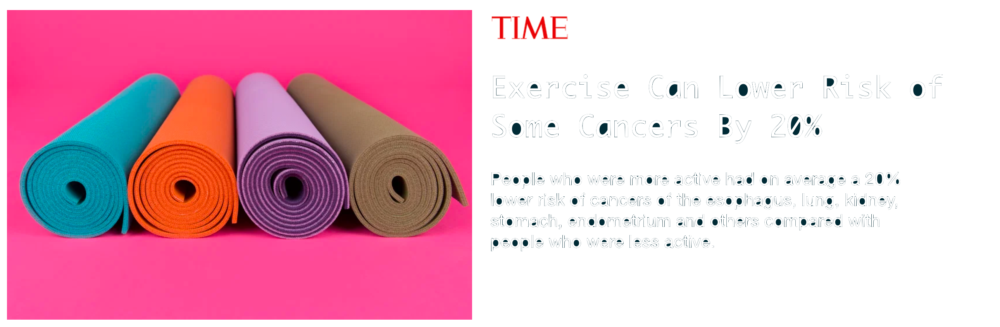
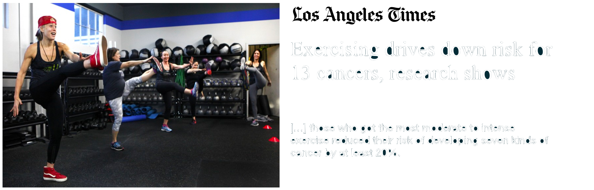
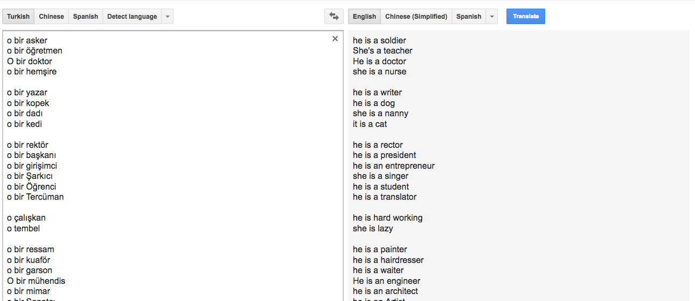
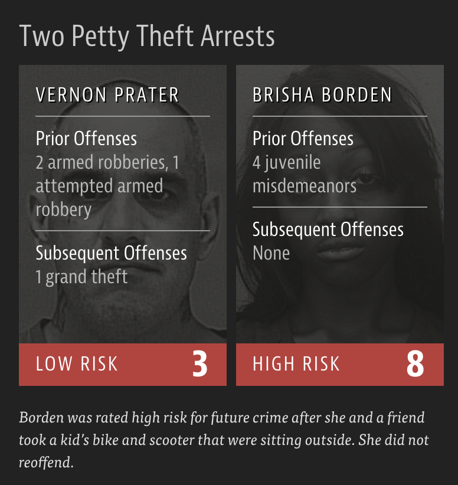

```{r child = "../setup.Rmd"}
```

```{r packages, echo = FALSE, message=FALSE, warning=FALSE}
library(tidyverse)
library(lubridate)
library(scales)
```

class: middle

# Causality

---

```{r echo=FALSE, out.width = "100%"}

```

.footnote[
.midi[
Alice Park. [Exercise Can Lower Risk of Some Cancers By 20%](https://time.com/4330041/reduce-cancer-risk-exercise/). Time Magazine. 16 May 2016.
]
]

---

```{r echo=FALSE, out.width = "100%"}

```

.footnote[
.midi[
Melissa Healy. [Exercising drives down risk for 13 cancers, research shows
](https://www.latimes.com/science/sciencenow/la-sci-sn-exercising-cancer-20160516-story.html).  
Los Angeles Times. 16 May 2016.
]
]

---

## Original study

Moore, Steven C., et al. **["Association of leisure-time physical activity with risk of 26 types of cancer in 1.44 million adults."](https://jamanetwork.com/journals/jamainternalmedicine/fullarticle/2521826)** JAMA internal medicine 176.6 (2016): 816-825.

- **Volunteers** were **asked** about their physical activity level over the preceding year. 
- Half exercised less than about 150 minutes per week, half exercised more. 
- Compared to the bottom 10% of exercisers, the top 10% had lower rates of esophageal, liver, lung, endometrial, colon, and breast cancer.
- Researchers found no association between exercising and 13 other cancers (e.g. pancreatic, ovarian, and brain).

.footnote[
.midi[
Carl Bergstrom and Jevin West. [Calling Bullshit: The art of skepticism in a data-driven world](https://www.callingbullshit.org/).  
Random House, 2020.  
Sharon Begley. ["Does exercise prevent cancer?"](https://www.statnews.com/2016/05/16/exercise-prevent-cancer/). StatNews. 16 May 2016. 
]
]

---

class: middle

# Axes and scale

---

.question[
What is the difference between these two pictures? Which presents a better way to represent these data?
]

```{r echo=FALSE, out.width="80%"}
knitr::include_graphics("img/axis-start-at-0.png")
```

.footnote[
.midi[
Christopher Ingraham. ["You’ve been reading charts wrong. Here’s how a pro does it."](https://www.washingtonpost.com/business/2019/10/14/youve-been-reading-charts-wrong-heres-how-pro-does-it/).  
The Washington Post. 14 October 2019.
]
]

---

.question[
What is wrong with this picture? How would you correct it?
]

```{r echo=FALSE, out.width="70%"}
knitr::include_graphics("img/cost_of_gas.png")
```

---

.pull-left-wide[
```{r echo=FALSE, out.width="100%"}
df <- tibble(
  date = ymd(c("2019-11-01", "2020-10-25", "2020-11-01")),
  cost = c(3.17, 3.51, 3.57)
)
ggplot(df, aes(x = date, y = cost, group = 1)) +
  geom_point() +
  geom_line() +
  geom_label(aes(label = cost), hjust = -0.25) +
  labs(
    title = "Cost of gas",
    subtitle = "National average",
    x = NULL, y = NULL, 
    caption = "Source: AAA Fuel Gauge Report"
  ) +
  scale_x_continuous(
    breaks = ymd(c("2019-11-01", "2020-10-25", "2020-11-01")), 
    labels = c("Last year", "Last week", "Current"),
    guide = guide_axis(angle = 90),
    limits = ymd(c("2019-11-01", "2020-11-29")),
    minor_breaks = ymd(c("2019-11-01", "2020-10-25", "2020-11-01"))
  ) +
  scale_y_continuous(labels = label_dollar())
```
]
.pull-right-narrow[
```{r echo=FALSE, out.width="100%"}
knitr::include_graphics("img/cost_of_gas.png")
```
]

---

.question[
What is wrong with this picture? How would you correct it?
]

```{r echo=FALSE, out.width="75%", fig.align = "left"}
knitr::include_graphics("img/ga-dph-declining-bars.jpg")
```

---

## Graph detective

.center[
<iframe width="900" height="450" src="https://livefreeordichotomize.com/2020/05/17/graph-detective/" frameborder="0"></iframe>  
]

.footnote[
.midi[
Lucy D'Agostino McGowan. [Graph detective](https://livefreeordichotomize.com/2020/05/17/graph-detective/). Live Free or Dichotomize. 17 May 2020.
]
]

---

# Maps and areas

---

.question[
Do you recognize this map? What does it show?
]

```{r echo=FALSE,  out.width="60%"}
knitr::include_graphics("img/election-2016-county.png")
```

--

.footnote[
.midi[
Lazaro Gamio. ["Election maps are telling you big lies about small things"](https://www.washingtonpost.com/graphics/politics/2016-election/how-election-maps-lie/).  
The Washington Post. 1 Nov 2016.
]
]

---

.pull-left[
```{r echo=FALSE, out.width="60%"}
knitr::include_graphics("img/citizens-for-trump.png")
```
]
--
.pull-right[
```{r echo=FALSE, out.width="60%"}
knitr::include_graphics("img/counties-for-trump.png")
```
]

.footnote[
.midi[
Alberto Cairo. [Visual Trumpery talk](https://visualtrumperytour.wordpress.com/).
]
]

---

```{r echo=FALSE, out.width="65%"}

```

.footnote[
.midi[
Alberto Cairo. [Visual Trumpery talk](https://visualtrumperytour.wordpress.com/).
]
]

---

```{r echo=FALSE, out.width=900}
knitr::include_graphics("img/cairo-what-matters.png")
```

.footnote[
.midi[
Alberto Cairo. [Visual Trumpery talk](https://visualtrumperytour.wordpress.com/).
]
]

---

class: middle

# Visualising uncertainty

---

On December 19, 2014, the front page of Spanish national newspaper El
País read *"Catalan public opinion swings toward 'no' for independence, says survey"*.

```{r echo=FALSE,warning=F}
catalan <- tibble(
  response = c("No", "Yes", "No answer"),
  rate     = c(45.3, 44.5, 10.2)
) %>%
  mutate(response = fct_relevel(response, "No", "Yes", "No answer"))
```

```{r catalan-misleading, echo=FALSE,out.width="60%",warning=F}
ggplot(catalan, aes(y = fct_rev(response), x = rate, color = response, group = response)) +
  geom_point() +
  geom_segment(aes(x = 0, xend = rate, 
                   y = fct_rev(response), yend = fct_rev(response)),
               size = 1) +
  scale_color_manual(values = c("#5C8AA9", "#9D303A", "gray")) +
  scale_x_continuous(labels = label_percent(scale = 1)) +
  guides(color = FALSE) +
  theme_minimal(base_size = 16) +
  labs(
    title = "Do you want Catalonia\nto become an independent state?",
    caption = "Margin of error: +/-2.95% at 95% confidence level",
    x = NULL, y = NULL
  )
```

.footnote[
.midi[
Alberto Cairo. [The truthful art: Data, charts, and maps for communication](http://www.thefunctionalart.com/p/the-truthful-art-book.html). New Riders, 2016.
]
]

---

.pull-left-wide[
```{r echo=FALSE, out.width="100%",warning=F}
catalan <- catalan %>%
  mutate(
    low = rate - 2.95,
    high = rate + 2.95
  )
ggplot(catalan, aes(y = fct_rev(response), x = rate, color = response, group = response)) +
  geom_segment(aes(x = low, xend = high, 
                   y = fct_rev(response), yend = fct_rev(response)),
               size = 0.8, color = "black") +
  geom_point(size = 3) +
  scale_color_manual(values = c("#5C8AA9", "#9D303A", "gray")) +
  scale_x_continuous(labels = label_percent(scale = 1)) +
  guides(color = FALSE) +
  theme_minimal(base_size = 16) +
  labs(
    title = "Do you want Catalonia\nto become an independent state?",
    caption = "The probability of the tiny difference between the\n'No' and 'Yes' being just due to random chance is very high.",
    x = NULL, y = NULL
  )
```
]
.pull-right-narrow[
```{r ref.label="catalan-misleading", out.width = "100%", echo = FALSE,warning=F}
```
]

.footnote[
.midi[
Alberto Cairo. ["Uncertainty and Graphicacy: How Should Statisticians Journalists and Designers Reveal Uncertainty in Graphics for Public Consumption?"](https://ec.europa.eu/eurostat/cros/powerfromstatistics/OR/PfS-OutlookReport-Cairo.pdf), Power from Statistics: Data Information and Knowledge, 2017.
]
]

---

class: middle

# Further reading

---

.pull-left[
```{r echo=FALSE, out.width=350, fig.align="right"}
knitr::include_graphics("img/cairo-how-charts-lie.jpg")
```
]
.pull-right[
[How Charts Lie](http://www.thefunctionalart.com/p/reviews.html)  
Getting Smarter about Visual Information  

by Alberto Cairo
]

---

.pull-left[
```{r echo=FALSE, out.width=350, fig.align="right"}
knitr::include_graphics("img/calling-bullshit.png")
```
]
.pull-right[
[Calling Bullshit](https://www.callingbullshit.org/)  
The Art of Skepticism in a  
Data-Driven World   

by Carl Bergstrom and Jevin West
]

# Case study: 
# AOL search data leak 

---

```{r echo=FALSE, out.width="80%"}
knitr::include_graphics("img/aol-data-leak.png")
```

.footnote[
.midi[
Michael Barbaro and Tom Zeller Jr. [A Face Is Exposed for AOL Searcher No. 4417749](https://www.nytimes.com/2006/08/09/technology/09aol.html).  
New York Times. 9 August 2006.
]
]

---
class: middle

# Case study: 
# OK Cupid

---

## OK Cupid data breach

- In 2016, researchers published data of 70,000 OkCupid users—including usernames, political leanings, drug usage, and intimate sexual details

- Researchers didn't release the real names and pictures of OKCupid users, but their identities could easily be uncovered from the details provided, e.g. usernames

--

.pull-left-wide[
>Some may object to the ethics of gathering and releasing this data. However, all the data found in the dataset are or were already publicly available, so releasing this dataset merely presents it in a more useful form. 
>
>Researchers Emil Kirkegaard and Julius Daugbjerg Bjerrekær
]

---

.question[
In analysis of data that individuals willingly shared publicly on a given platform (e.g. social media), how do you make sure you don't violate reasonable expectations of privacy?
]

```{r echo=FALSE}
knitr::include_graphics("img/okcupid-tweet.png")
```

---

class: middle

# Case study: 
# Facebook & Cambridge Analytica

---

```{r echo=FALSE, out.width="75%"}
knitr::include_graphics("img/facebook-cambridge-analytica-scandal-explained-the-guardian-graphic.jpg")
```

.footnote[
.midi[
Carole Cadwalladr and Emma Graham-Harrison. [How Cambridge Analytica turned Facebook ‘likes’ into a lucrative political tool](https://www.theguardian.com/technology/2018/mar/17/facebook-cambridge-analytica-kogan-data-algorithm). The Guardian. 17 March 2018.
]
]

---

class: middle

# Algorithmic bias and gender

---

## Google Translate

```{r echo=FALSE, out.width="100%"}

```

---

## Amazon's experimental hiring algorithm

- Used AI to give job candidates scores ranging from one to five stars -- much like shoppers rate products on Amazon
- Amazon's system was not rating candidates for software developer jobs and other technical posts in a gender-neutral way; it taught itself that male candidates were preferable

.pull-left-wide[
>Gender bias was not the only issue. Problems with the data that underpinned the models’ judgments meant that unqualified candidates were often recommended for all manner of jobs, the people said.
]

.footnote[
Jeffrey Dastin. [Amazon scraps secret AI recruiting tool that showed bias against women](https://reut.rs/2Od9fPr).  
Reuters. 10 Oct 2018.
]

---

class: middle

# Algorithmic bias and race

---

## Facial recognition

```{r echo=FALSE, out.width="35%"}
knitr::include_graphics("img/guardian-facial-recognition.png")
```

.footnote[
.midi[
Ian Tucker. ['A white mask worked better': why algorithms are not colour blind](https://www.theguardian.com/technology/2017/may/28/joy-buolamwini-when-algorithms-are-racist-facial-recognition-bias).  
The Guardian. 28 May 2017.
]
]

---

## Criminal Sentencing

.center[
There’s software used across the country to predict future criminals.  
And it’s biased against blacks.
]

```{r out.width="60%", echo=FALSE}
knitr::include_graphics("img/propublica-criminal-sentencing.png")
```

.footnote[
.midi[
Julia Angwin, Jeff Larson, Surya Mattu, and Lauren Kirchner. [Machine Bias](https://www.propublica.org/article/machine-bias-risk-assessments-in-criminal-sentencing). 23 May 2016. ProPublica.
]
]

---

## A tale of two convicts

.pull-left[

]
--
.pull-right[

]

---

class: middle

>“Although these measures were crafted with the best of intentions, I am concerned that they inadvertently undermine our efforts to ensure individualized and equal justice,” he said, adding, “they may exacerbate unwarranted and unjust disparities that are already far too common in our criminal justice system and in our society.”
>  
>Then U.S. Attorney General Eric Holder (2014)

---

## ProPublica analysis

### **Data:**

Risk scores assigned to more than 7,000 people arrested in Broward County, Florida, in 2013 and 2014 + whether they were charged with new crimes over the next two years

---

## ProPublica analysis

### **Results:**

- 20% of those predicted to commit violent crimes actually did
- Algorithm had higher accuracy (61%) when full range of crimes taken into account (e.g. misdemeanors)
```{r echo=FALSE, out.width = "85%"}
knitr::include_graphics("img/propublica-results.png")
```
- Algorithm was more likely to falsely flag black defendants as future criminals, at almost twice the rate as white defendants
- White defendants were mislabeled as low risk more often than black defendants

---

## How to write a racist AI without trying

.center[
<iframe width="900" height="450" src="https://notstatschat.rbind.io/2018/09/27/how-to-write-a-racist-ai-in-r-without-really-trying/" frameborder="0" style="background:white;"></iframe>  
]

.footnote[
.midi[
Thomas Lumley. [How to write a racist AI in R without really trying](https://notstatschat.rbind.io/2018/09/27/how-to-write-a-racist-ai-in-r-without-really-trying/).  
Biased and Inefficient. 27 September 2018.
]
]

---

class: middle

# Further reading

---

## Machine Bias

.pull-left[
```{r echo=FALSE, out.width="100%"}
knitr::include_graphics("img/propublica-machine-bias.png")
```
]
.pull-right[
[Machine Bias](https://www.propublica.org/article/machine-bias-risk-assessments-in-criminal-sentencing)  
<br>
by Julia Angwin, Jeff Larson, Surya Mattu, and Lauren Kirchner
]

---

## Ethics and Data Science

.pull-left[
```{r echo=FALSE, out.width="65%"}
knitr::include_graphics("img/ethics-data-science.jpg")
```
]
.pull-right[
[Ethics and Data Science](https://www.amazon.com/Ethics-Data-Science-Mike-Loukides-ebook/dp/B07GTC8ZN7)  
<br>
by Mike Loukides, Hilary Mason, DJ Patil  
(Free Kindle download)
]

---

## Weapons of Math Destruction

.pull-left[
```{r echo=FALSE, out.width="65%"}
knitr::include_graphics("img/weapons-of-math-destruction.jpg")
```
]
.pull-right[
[Weapons of Math Destruction](https://www.penguin.co.uk/books/304/304513/weapons-of-math-destruction/9780141985411.html)  
How Big Data Increases Inequality and Threatens Democracy  
<br>
by Cathy O'Neil
]

---

## Algorithms of Oppression

.pull-left[
```{r echo=FALSE, out.width="65%"}
knitr::include_graphics("img/algorithms-of-oppression.jpg")
```
]
.pull-right[
[Algorithms of Oppression](https://nyupress.org/9781479837243/algorithms-of-oppression/)  
How Search Engines Reinforce Racism  
<br>
by Safiya Umoja Noble
]

---

## Parting thoughts

- At some point during your data science learning journey you will learn tools that can be used unethically
- You might also be tempted to use your knowledge in a way that is ethically questionable either because of business goals or for the pursuit of further knowledge (or because your boss told you to do so)

.question[
How do you train yourself to make the right decisions (or reduce the likelihood of accidentally making the wrong decisions) at those points?
]

---

## Do good with data

- Data Science for Social Good: 
  - [The Alan Turing Institute](https://www.turing.ac.uk/collaborate-turing/data-science-social-good)
  - [University of Chicago](https://dssg.uchicago.edu/)
- [DataKind](https://www.datakind.org/): DataKind brings high-impact organizations together with leading data scientists to use data science in the service of humanity.
- Sign the Manifesto for Data Practices: [datapractices.org/manifesto](https://datapractices.org/manifesto/)

---

## Further watching

.center[
<iframe width="800" height="450" src="https://www.youtube.com/embed/fgf2VjnhpCs?start=1162" frameborder="0" allow="accelerometer; autoplay; encrypted-media; gyroscope; picture-in-picture" allowfullscreen></iframe>  
]

.footnote[
.midi[
Julien Cornebise. AI for Good in the R and Python ecosystems. useR 2019.
]
]
