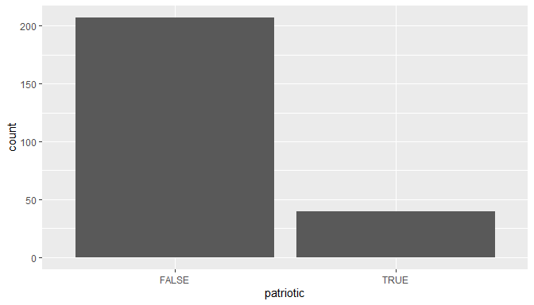
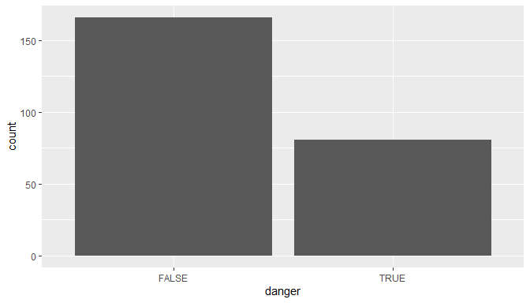
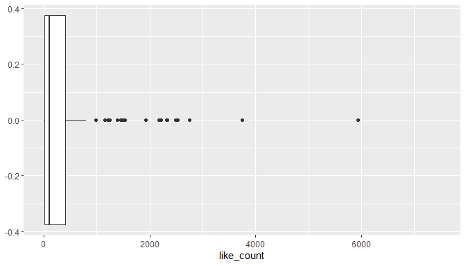
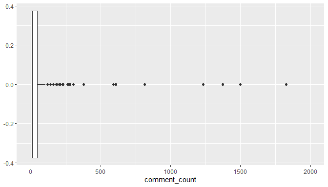
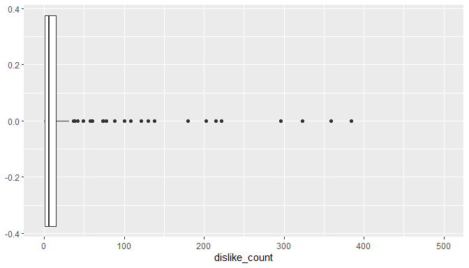
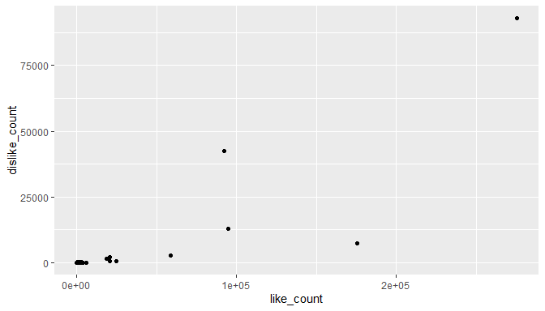
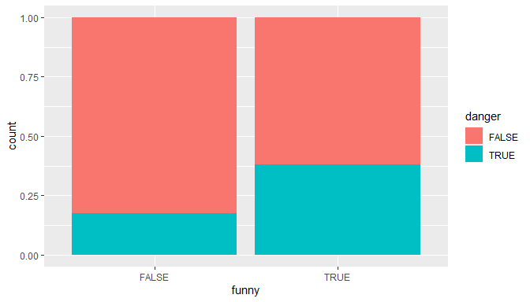
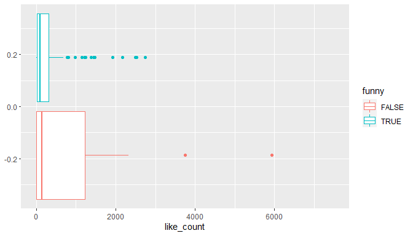
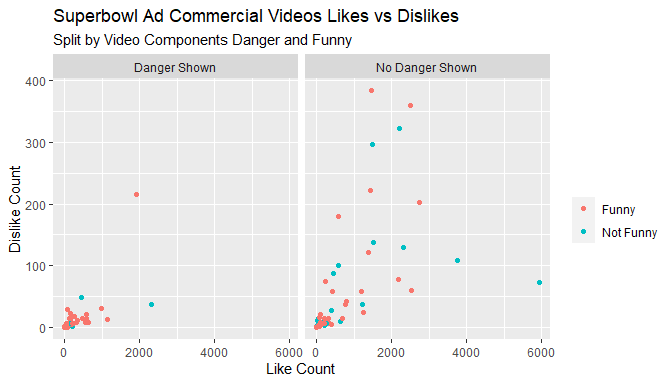

Exam 1 DSC 223 Fall 2021 Block 1
================
Exam Solution
Due: 12/3/2021 at 11:59 PM

## Academic Honesty Statement

I, Tyler George, hereby state that I have not communicated with or
gained information in any way from my classmates or anyone other than
the Professor or TA during this exam, and that all work is my own.

## Load data

Complete the function to read the data in from the data folder.

``` r
youtube <- read.csv('data/youtube.csv')
```

### Answer the following about the day, month, and year you were born in (number format). Change the **eval=F** to T. Do not change the **include**.

You should use this new YouTube data for the remainder of the exam.

## Load packages

``` r
library(tidyverse)
```

    ## Warning: package 'ggplot2' was built under R version 4.0.5

    ## Warning: package 'tibble' was built under R version 4.0.5

    ## Warning: package 'tidyr' was built under R version 4.0.5

    ## Warning: package 'readr' was built under R version 4.0.5

    ## Warning: package 'purrr' was built under R version 4.0.5

    ## Warning: package 'dplyr' was built under R version 4.0.5

    ## Warning: package 'stringr' was built under R version 4.0.5

    ## Warning: package 'forcats' was built under R version 4.0.5

``` r
library(ggridges)
```

    ## Warning: package 'ggridges' was built under R version 4.0.5

## Questions

### Question 1

``` r
glimpse(youtube1)
```

    ## Rows: 247
    ## Columns: 25
    ## $ year                      <int> 2002, 2009, 2014, 2001, 2016, 2007, 2010, 20~
    ## $ brand                     <chr> "Budweiser", "Pepsi", "Toyota", "Pepsi", "Bu~
    ## $ superbowl_ads_dot_com_url <chr> "https://superbowl-ads.com/2002-budweiser-ho~
    ## $ youtube_url               <chr> "https://www.youtube.com/watch?v=mhEYXcCB1Qw~
    ## $ funny                     <lgl> TRUE, TRUE, TRUE, TRUE, TRUE, FALSE, TRUE, T~
    ## $ show_product_quickly      <lgl> TRUE, FALSE, TRUE, FALSE, TRUE, TRUE, TRUE, ~
    ## $ patriotic                 <lgl> FALSE, FALSE, FALSE, FALSE, TRUE, FALSE, FAL~
    ## $ celebrity                 <lgl> FALSE, FALSE, TRUE, FALSE, TRUE, FALSE, FALS~
    ## $ danger                    <lgl> FALSE, TRUE, FALSE, FALSE, FALSE, FALSE, TRU~
    ## $ animals                   <lgl> FALSE, FALSE, TRUE, FALSE, TRUE, TRUE, TRUE,~
    ## $ use_sex                   <lgl> FALSE, FALSE, FALSE, TRUE, FALSE, FALSE, FAL~
    ## $ id                        <chr> "mhEYXcCB1Qw", "qUZaSf7T7ig", "b01P9PaaoLk",~
    ## $ kind                      <chr> "youtube#video", "youtube#video", "youtube#v~
    ## $ etag                      <chr> "Tlh2uZ20QqPkKiWpKL36eCvOjBc", "N1MkFXKysCWQ~
    ## $ view_count                <int> 38574, 129399, 25834, 788, 487, 11311, 13205~
    ## $ like_count                <int> 199, 345, 140, 4, NA, 29, 273, 12, 3744, 0, ~
    ## $ dislike_count             <int> 7, 12, 5, 2, NA, 3, 18, 4, 108, 0, 0, 296, 7~
    ## $ favorite_count            <int> 0, 0, 0, 0, 0, 0, 0, 0, 0, 0, 0, 0, 0, 0, 0,~
    ## $ comment_count             <int> 8, 42, 18, 0, 2, 1, 15, 3, 279, 0, 1, 88, 26~
    ## $ published_at              <chr> "2016-01-27 21:22:23", "2009-02-02 01:09:13"~
    ## $ title                     <chr> "Budweiser Commercial -- How you doin'", "Pe~
    ## $ description               <chr> NA, "Pepsi Max - I'm Good\nSuper Bowl XLIII ~
    ## $ thumbnail                 <chr> NA, NA, "https://i.ytimg.com/vi/b01P9PaaoLk/~
    ## $ channel_title             <chr> "Esca.me FunTastic English", "reggiep08v2", ~
    ## $ category_id               <int> 27, 23, 22, 24, 24, 1, 24, 23, 15, 15, 24, 2~

``` r
youtube1 %>% select(funny)%>%
      ggplot(aes(x=funny))+
      geom_bar()
```

<!-- -->

Looks like two thirds of the videos are funny.

``` r
youtube1 %>% select(patriotic)%>%
      ggplot(aes(x=patriotic))+
      geom_bar()
```

<!-- -->

Very few of the videos are patriotic. Only around 30 out of the 247.

``` r
youtube1 %>% select(danger)%>%
      ggplot(aes(x=danger))+
      geom_bar()
```

<!-- -->

Around 75 of the 247 videos contained danger. I would not have expected
this.

``` r
youtube1 %>% select(like_count)%>%
      ggplot(aes(x=like_count))+
      geom_boxplot()+
      scale_x_continuous(limits = c(0,7500))
```

    ## Warning: Removed 33 rows containing non-finite values (stat_boxplot).

<!-- -->

``` r
youtube1 %>% select(comment_count)%>%
      ggplot(aes(x=comment_count))+
      geom_boxplot()+
      scale_x_continuous(limits = c(0,2000))
```

    ## Warning: Removed 25 rows containing non-finite values (stat_boxplot).

<!-- -->

``` r
youtube1 %>% select(dislike_count)%>%
      ggplot(aes(x=dislike_count))+
      geom_boxplot()+
      scale_x_continuous(limits = c(0,500))
```

    ## Warning: Removed 33 rows containing non-finite values (stat_boxplot).

<!-- -->

All three boxplots of dislike counts, comment count, and like counts are
heavily skewed right. We have zoomed in so we can see the distribution
aside from just the outliers.

### Question 2

``` r
youtube1 %>% 
  ggplot(aes(x=like_count,y=dislike_count))+
  geom_point()
```

    ## Warning: Removed 18 rows containing missing values (geom_point).

<!-- -->

``` r
youtube1 %>% 
  ggplot(aes(x=funny,fill=danger))+
  geom_bar(position = "fill")
```

<!-- -->

``` r
youtube1 %>% 
  ggplot(aes(x=like_count,colour=funny))+
  geom_boxplot()+
      scale_x_continuous(limits = c(0,7500))
```

    ## Warning: Removed 33 rows containing non-finite values (stat_boxplot).

<!-- -->

Looking ath like count vs disklike count we see that thay are related
with some extreme outliers.

The barchart of funny and danger shows us that for videos without funny
elements, around 15% of them contain danger but videos with funny are
different, around 35% containing danger.

Finally our zoomed in barchart of like count split by funny shows us
that non funny videos have a much larger variability than funny videos
in like counts. It also shows us, surprisingly, that non funny videos
tend to be more reliably high in likes.

### Question 3

``` r
youtube1 %>% 
  filter(like_count <7500,dislike_count<500)%>%
  mutate(funny = case_when(
    funny == TRUE ~ "Funny",
    funny == FALSE ~ "Not Funny"),
    danger = case_when(
      danger == TRUE ~ "Danger Shown",
      danger == FALSE ~ "No Danger Shown")
    )%>%
  ggplot(aes(x=like_count,y=dislike_count,colour=funny))+
  geom_point()+
  facet_wrap(~danger)+
  labs(title = "Superbowl Ad Commercial Videos Likes vs Dislikes",
       subtitle = "Split by Video Components Danger and Funny",
       x= "Like Count",
       y = "Dislike Count",
       colour = "")
```

<!-- -->

This plot allows us to compare dislikes vs likes between but broken down
but by both whether the video has funny (or not) elements and if it
contained danger. For visualizing extreme outliers are trimmed off.
There does not seem to be any evidence that danger and funny are
related. There is a very clear differnce for like counts and dislike
counts based on whether the video has funny components (as seen before).

### Question 4

This is partially done before. Lets look at just funny and like counts.

``` r
youtube1 %>% 
  filter(like_count <7500)%>%
  mutate(funny = case_when(
    funny == TRUE ~ "Funny",
    funny == FALSE ~ "Not Funny"))%>%
  ggplot(aes(y=like_count,fill=funny))+
  geom_boxplot()+
  labs(fill = "",
       title = "Like Count by Funny or Not",
       y = "Like Count")
```

<!-- -->

### Question 5

``` r
youtube1 %>% mutate(ratio = like_count/view_count) %>%
  filter(funny==TRUE)%>%
  summarize(med_f_ratio = median(ratio,na.rm=T))
```

    ##   med_f_ratio
    ## 1 0.002963989

``` r
youtube1 %>% mutate(ratio = like_count/view_count) %>%
  filter(show_product_quickly==TRUE)%>%
  summarize(med_s_ratio = median(ratio,na.rm=T))
```

    ##   med_s_ratio
    ## 1 0.003162041

``` r
youtube1 %>% mutate(ratio = like_count/view_count) %>%
  filter(patriotic==TRUE)%>%
  summarize(med_p_ratio = median(ratio,na.rm=T))
```

    ##   med_p_ratio
    ## 1 0.004204166

``` r
youtube1 %>% mutate(ratio = like_count/view_count) %>%
  filter(celebrity==TRUE)%>%
  summarize(med_c_ratio = median(ratio,na.rm=T))
```

    ##   med_c_ratio
    ## 1 0.005419215

``` r
youtube1 %>% mutate(ratio = like_count/view_count) %>%
  filter(danger==TRUE)%>%
  summarize(med_d_ratio = median(ratio,na.rm=T))
```

    ##   med_d_ratio
    ## 1 0.003080881

``` r
youtube1 %>% mutate(ratio = like_count/view_count) %>%
  filter(animals==TRUE)%>%
  summarize(med_a_ratio = median(ratio,na.rm=T))
```

    ##   med_a_ratio
    ## 1  0.00292295

``` r
youtube1 %>% mutate(ratio = like_count/view_count) %>%
  filter(use_sex==TRUE)%>%
  summarize(med_u_ratio = median(ratio,na.rm=T))
```

    ##   med_u_ratio
    ## 1 0.002738705

Celebrity appears to have the highest median ratio of like counts to
view counts at .0054 (still pretty low).

This could be better solved with pivots.

### Question 6

``` r
youtube1 %>% mutate(ratio = dislike_count/view_count) %>%
  filter(funny==TRUE)%>%
  summarize(med_f_ratio = median(ratio,na.rm=T))
```

    ##    med_f_ratio
    ## 1 0.0001452795

``` r
youtube1 %>% mutate(ratio = dislike_count/view_count) %>%
  filter(show_product_quickly==TRUE)%>%
  summarize(med_s_ratio = median(ratio,na.rm=T))
```

    ##   med_s_ratio
    ## 1 0.000173586

``` r
youtube1 %>% mutate(ratio = dislike_count/view_count) %>%
  filter(patriotic==TRUE)%>%
  summarize(med_p_ratio = median(ratio,na.rm=T))
```

    ##    med_p_ratio
    ## 1 0.0001869683

``` r
youtube1 %>% mutate(ratio = dislike_count/view_count) %>%
  filter(celebrity==TRUE)%>%
  summarize(med_c_ratio = median(ratio,na.rm=T))
```

    ##   med_c_ratio
    ## 1 0.000167043

``` r
youtube1 %>% mutate(ratio = dislike_count/view_count) %>%
  filter(danger==TRUE)%>%
  summarize(med_d_ratio = median(ratio,na.rm=T))
```

    ##    med_d_ratio
    ## 1 0.0001271182

``` r
youtube1 %>% mutate(ratio = dislike_count/view_count) %>%
  filter(animals==TRUE)%>%
  summarize(med_a_ratio = median(ratio,na.rm=T))
```

    ##    med_a_ratio
    ## 1 0.0001117856

``` r
youtube1 %>% mutate(ratio = dislike_count/view_count) %>%
  filter(use_sex==TRUE)%>%
  summarize(med_u_ratio = median(ratio,na.rm=T))
```

    ##    med_u_ratio
    ## 1 7.804866e-05

The lowest dislike count to view count is actually videos with sex
portrayed in the video. This means that just because you get the most
likes for each video does not mean you neccesariy get the least dislikes
for each view.

### Question 7

``` r
youtube1 %>% count(funny,danger)
```

    ##   funny danger   n
    ## 1 FALSE  FALSE  52
    ## 2 FALSE   TRUE  11
    ## 3  TRUE  FALSE 114
    ## 4  TRUE   TRUE  70

``` r
youtube1 %>% count(funny,show_product_quickly)
```

    ##   funny show_product_quickly   n
    ## 1 FALSE                FALSE  23
    ## 2 FALSE                 TRUE  40
    ## 3  TRUE                FALSE  53
    ## 4  TRUE                 TRUE 131

``` r
youtube1 %>% count(funny,patriotic )
```

    ##   funny patriotic   n
    ## 1 FALSE     FALSE  36
    ## 2 FALSE      TRUE  27
    ## 3  TRUE     FALSE 171
    ## 4  TRUE      TRUE  13

``` r
youtube1 %>% count(funny,celebrity)
```

    ##   funny celebrity   n
    ## 1 FALSE     FALSE  44
    ## 2 FALSE      TRUE  19
    ## 3  TRUE     FALSE 122
    ## 4  TRUE      TRUE  62

``` r
youtube1 %>% count(funny,animals)
```

    ##   funny animals   n
    ## 1 FALSE   FALSE  37
    ## 2 FALSE    TRUE  26
    ## 3  TRUE   FALSE 115
    ## 4  TRUE    TRUE  69

``` r
youtube1 %>% count(funny,use_sex)
```

    ##   funny use_sex   n
    ## 1 FALSE   FALSE  56
    ## 2 FALSE    TRUE   7
    ## 3  TRUE   FALSE 134
    ## 4  TRUE    TRUE  50

``` r
youtube1 %>% count(show_product_quickly,patriotic)
```

    ##   show_product_quickly patriotic   n
    ## 1                FALSE     FALSE  65
    ## 2                FALSE      TRUE  11
    ## 3                 TRUE     FALSE 142
    ## 4                 TRUE      TRUE  29

``` r
youtube1 %>% count(show_product_quickly,celebrity)
```

    ##   show_product_quickly celebrity   n
    ## 1                FALSE     FALSE  54
    ## 2                FALSE      TRUE  22
    ## 3                 TRUE     FALSE 112
    ## 4                 TRUE      TRUE  59

``` r
youtube1 %>% count(show_product_quickly,danger)
```

    ##   show_product_quickly danger   n
    ## 1                FALSE  FALSE  52
    ## 2                FALSE   TRUE  24
    ## 3                 TRUE  FALSE 114
    ## 4                 TRUE   TRUE  57

``` r
youtube1 %>% count(show_product_quickly,animals)
```

    ##   show_product_quickly animals   n
    ## 1                FALSE   FALSE  52
    ## 2                FALSE    TRUE  24
    ## 3                 TRUE   FALSE 100
    ## 4                 TRUE    TRUE  71

``` r
youtube1 %>% count(show_product_quickly,use_sex)
```

    ##   show_product_quickly use_sex   n
    ## 1                FALSE   FALSE  62
    ## 2                FALSE    TRUE  14
    ## 3                 TRUE   FALSE 128
    ## 4                 TRUE    TRUE  43

``` r
youtube1 %>% count(patriotic,celebrity)
```

    ##   patriotic celebrity   n
    ## 1     FALSE     FALSE 138
    ## 2     FALSE      TRUE  69
    ## 3      TRUE     FALSE  28
    ## 4      TRUE      TRUE  12

``` r
youtube1 %>% count(patriotic,danger)
```

    ##   patriotic danger   n
    ## 1     FALSE  FALSE 131
    ## 2     FALSE   TRUE  76
    ## 3      TRUE  FALSE  35
    ## 4      TRUE   TRUE   5

``` r
youtube1 %>% count(patriotic,animals)
```

    ##   patriotic animals   n
    ## 1     FALSE   FALSE 132
    ## 2     FALSE    TRUE  75
    ## 3      TRUE   FALSE  20
    ## 4      TRUE    TRUE  20

``` r
youtube1 %>% count(patriotic,use_sex)
```

    ##   patriotic use_sex   n
    ## 1     FALSE   FALSE 152
    ## 2     FALSE    TRUE  55
    ## 3      TRUE   FALSE  38
    ## 4      TRUE    TRUE   2

``` r
youtube1 %>% count(celebrity,danger)
```

    ##   celebrity danger   n
    ## 1     FALSE  FALSE 106
    ## 2     FALSE   TRUE  60
    ## 3      TRUE  FALSE  60
    ## 4      TRUE   TRUE  21

``` r
youtube1 %>% count(celebrity,animals)
```

    ##   celebrity animals  n
    ## 1     FALSE   FALSE 93
    ## 2     FALSE    TRUE 73
    ## 3      TRUE   FALSE 59
    ## 4      TRUE    TRUE 22

``` r
youtube1 %>% count(celebrity,use_sex)
```

    ##   celebrity use_sex   n
    ## 1     FALSE   FALSE 140
    ## 2     FALSE    TRUE  26
    ## 3      TRUE   FALSE  50
    ## 4      TRUE    TRUE  31

``` r
youtube1 %>% count(danger,animals)
```

    ##   danger animals   n
    ## 1  FALSE   FALSE 111
    ## 2  FALSE    TRUE  55
    ## 3   TRUE   FALSE  41
    ## 4   TRUE    TRUE  40

``` r
youtube1 %>% count(danger,use_sex)
```

    ##   danger use_sex   n
    ## 1  FALSE   FALSE 129
    ## 2  FALSE    TRUE  37
    ## 3   TRUE   FALSE  61
    ## 4   TRUE    TRUE  20

``` r
youtube1 %>% count(animals,use_sex)
```

    ##   animals use_sex   n
    ## 1   FALSE   FALSE 115
    ## 2   FALSE    TRUE  37
    ## 3    TRUE   FALSE  75
    ## 4    TRUE    TRUE  20

The most common combination is funny videos that show products quickly.

### Question 8

Eliminated from grading - extra credit given for work.

### Question 9

We are going to look at the average likes per video with each component.

``` r
youtube_no_na <- youtube1 %>% 
          filter(!is.na(like_count),
          !is.na(funny),
          !is.na(show_product_quickly),
          !is.na(patriotic),
          !is.na(celebrity),
          !is.na(danger),
          !is.na(animals),
          !is.na(use_sex))

youtube_no_na %>% filter(funny == TRUE)%>%
  summarize(like_per_video = sum(like_count)/n())
```

    ##   like_per_video
    ## 1       5540.459

``` r
youtube_no_na %>% filter(show_product_quickly == TRUE)%>%
  summarize(like_per_video = sum(like_count)/n())
```

    ##   like_per_video
    ## 1       6550.798

``` r
youtube_no_na %>% filter(patriotic  == TRUE)%>%
  summarize(like_per_video = sum(like_count)/n())
```

    ##   like_per_video
    ## 1       11472.17

``` r
youtube_no_na %>% filter(celebrity == TRUE)%>%
  summarize(like_per_video = sum(like_count)/n())
```

    ##   like_per_video
    ## 1       7798.816

``` r
youtube_no_na %>% filter(danger == TRUE)%>%
  summarize(like_per_video = sum(like_count)/n())
```

    ##   like_per_video
    ## 1       4053.412

``` r
youtube_no_na %>% filter(animals == TRUE)%>%
  summarize(like_per_video = sum(like_count)/n())
```

    ##   like_per_video
    ## 1       2846.593

``` r
youtube_no_na %>% filter(use_sex == TRUE)%>%
  summarize(like_per_video = sum(like_count)/n())
```

    ##   like_per_video
    ## 1       695.3333

The average likes per video is patriotic at around 11,000. The next few
are closer together but celebrity, show product quickly and funny in
that order. Thus if you want a commercial that will get a lot of likes,
make it patriotic, with a celebrity, something funny and show your add
right away (according to this).

### Bonus

\[Enter code and narrative here.\]
