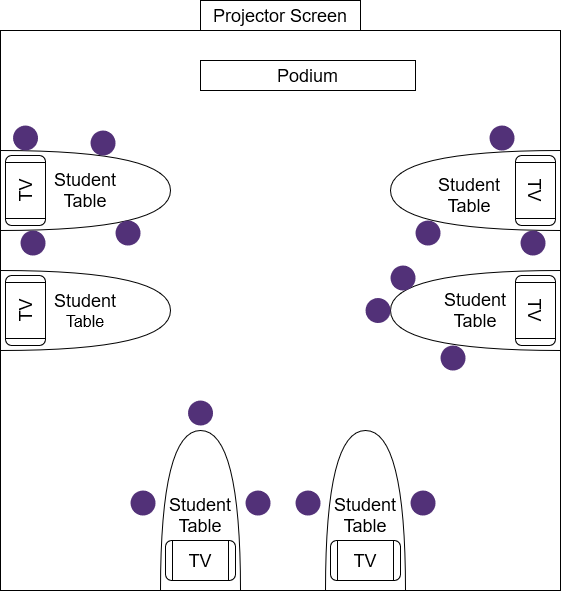
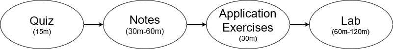
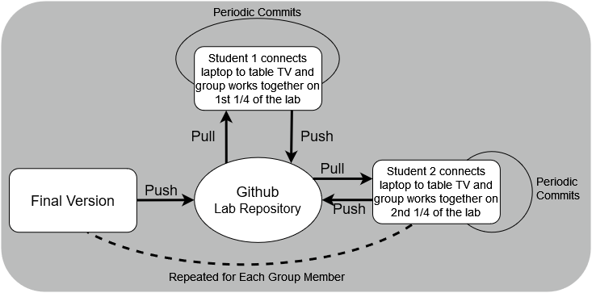

```{r child = "../course-materials/setup.Rmd"}
```

```{r packages, message=FALSE, warning=FALSE, include=FALSE}

packageVersion("xaringan")
library(knitr)
library(kableExtra)
library(RefManageR)
library(tidyverse)
BibOptions(check.entries = FALSE,
           bib.style = "authoryear",
           #cite.style = "alphabetic",
           style = "markdown",
           hyperlink = FALSE,
           dashed = FALSE
           )
Bib <- ReadBib("../Bib.bib", check = F)

```

# About Cornell College

- Small liberal arts college of about 1000 students
- One-Course-at-A-Time block schedule 
 - Each class occurs over 3.5 weeks including 18 days of 4 hours of instructional time and three weekends
- New majors in Applied Statistics and Data Science

---

# Course Objectives
- From the syllabus "respect, explore, understand, and utilize data in a way that is reproducible using version control."
- Data wrangling
- Utilizing version control & good organization to facilitate reproducible work
- Building technical skills in R, and RStudio, namely *tidyverse* functions
- Understanding and learning to consider ethical problems in data science
- Creating understandable and honest data visualizations
- Communicating statistical analysis

---

# Utilized Resources

- [Data Science in a Box](https://datasciencebox.org/index.html) by Mine `r Citet(Bib,"Cetinkaya-Rundel")`
- Data science ethics assignments from the [Quantitative Analysis Institute](https://sites.google.com/wellesley.edu/qai-online-resources/home) at Wellesley College `r Cite(Bib,"Pattanayak")`
- Workshops by Julia Silge available at [https://juliasilge.github.io/tidytext-tutorial/site/](https://juliasilge.github.io/tidytext-tutorial/site/)
- Many R packages were use throughout the class but [ghclass](https://rundel.github.io/ghclass/) was particularly useful for teaching/running the course
---

# The Class
.pull-left[
- This course has a pre-requisite of *either* introductory statistics or introductory computer science (python) 
- Total of 15 students
]

.pull-right[
```{r echo=FALSE, out.width="90%", fig.align="center"}

```
]

---

# A Day in the Class
- Each day consists of 2, 2 hour sessions.
- Typical class flow:
```{r echo=FALSE, out.width="80%", fig.align="left"}

```

- After the afternoon class each day students were assigned:
 - One R homework, 
 - Read 1-3 chapters of content from sources such as [R for Data Science](https://r4ds.had.co.nz/)
 - Read ethics related materials

---

# Course Schedule
```{r schedule,echo=F}
sch <- read.csv('DSC_223_Course_Schedule.csv',header =F) 
  sch %>% slice(1:9) %>%
  kbl(col.names = c("Day","Topics Covered"))%>%
  kable_styling(font_size = 20)%>%
  footnote('In reference to Data Science in a Box with S = Slides, AE = Application Exercises, L = Labs')

```

---

# Course Schedule
```{r schedule2,echo=F}
  sch %>% slice(10:18) %>%
  kbl(col.names = c("Day","Topics Covered"))%>%
  kable_styling(font_size = 20)%>%
  footnote('In reference to Data Science in a Box with S = Slides, AE = Application Exercises, L = Labs')

```


---

# Technologies
- Learning Management System (LMS) - Moodle
- [RStudio Server](https://www.rstudio.com/products/rstudio/download-server/) (new implementation for this course, see `r Citet(Bib,"Cetinkaya-Rundel2018")` for a discussion on infrastructure) 
 - A combination of [RMarkdown](https://rmarkdown.rstudio.com/) and R scripts were used
- Git and Github. 
 - Students used Git through the RStudio panel within an R project
 - I also used Github desktop application for some convenience such as pulling one students current work to help them
- R packages - primarily within the *tidyverse* 
 - [*ghclass*](https://rundel.github.io/ghclass/)  for distributing and collecting repositories `r Cite(Bib,"Rundel")`.
 
---

# Teaching Pedagogies
- Collaborative learning `r Cite(Bib,"Cary")`
```{r echo=FALSE, out.width="50%", fig.align="left"}

```
*Note: This was deviated from for projects and examples to simulate merge conflicts*
- Using tidyverse `r Cite(Bib,"Cetinkaya-Rundel2022")`
- Version control to lead to reproducible work `r Cite(Bib,"Beckman2021")`

---

# Learning the Bare Necessities
- I was new to Git, Github, RStudio Server (Linux), and a handful of the tidyverse packages and functions
- What did I *need* to learn to teach this class?
 - Git and Github: Basic Git functions such as push,pulling, and handling merge conflicts in RStudio
 - *ghclass* R package made much of the Git/Github learning much smoother. See the R script I created [here](https://github.com/stats-tgeorge/Utilizing_DS_Resources/tree/main/course-materials/ghclass-scripts)
 - RStudio server implementation and management required learning some basic Linux commands. See [here](https://github.com/stats-tgeorge/Utilizing_DS_Resources/blob/main/course-materials/Cluster%20Info%20and%20Commands.docx) for the commands I ended up needing
 - Learning the Xaringan R package to modify slides (now I'm using it for this!)
  - I converted the notes to pdf's. See my simple script [here](https://github.com/stats-tgeorge/Utilizing_DS_Resources/blob/main/course-materials/Notes/convertnotestopdf.R). I will host these using Github pages next time. 
 
---

# Student Comments
- "I enjoy working with my group on the project, although it did take countless hours outside of the classroom I enjoyed it a lot and felt accomplished after presenting."

-   "Working on labs and application exercises were beneficial for me. After completing those I could refer back to them which helped a lot. When working alone I often would get stuck on a exercise but when working in groups we were able to put our heads together and solve the problems. I really enjoyed that."

- "There were far too many notes in this class."

- "Going over the notes are necessary but I thought the length of the slides were way too long. It was hard to stay engaged the whole time when going
over the notes because I was not using the code in r I was just seeing the results on the powerpoint. I think the notes could be trimmed down some
to free up more space for application exercises."


---
# Future Updates
- Expanding the ethics discussion in the course
 - I will be working with a Cornell College faculty in Philosophy this summer.
 - Using some modules from `r Citep(Bib,"Beckman2022")`
- Trying out [gradetools](https://github.com/federicazoe/gradetools) to make grading quick while giving useful feedback to students `r Cite(Bib,"Federica")`
- Less statistical inference and more data wrangling
- Higher project expectations
- Github actions
- Rethinking of exams. The estimated time required was way off. 

---

# Acknowledgments

[Dr. Ajit Chavan](https://www.cornellcollege.edu/computer-science/faculty/index.shtml), Assistant Professor of Computer Science at Cornell College, for setting up the cluster used to run the RStudio Server and answering many of my questions about its use. 

---

# References

```{r refs, echo=FALSE, results="asis"}
NoCite(Bib,"*")
PrintBibliography(Bib,start =1,end=3)
```

---

# References

```{r refs2, echo=FALSE, results="asis"}
PrintBibliography(Bib,start =4,end=6)
```

---

# References

```{r refs3, echo=FALSE, results="asis"}
PrintBibliography(Bib,start =7,end = 10)
```

---

# References

```{r refs4, echo=FALSE, results="asis"}
PrintBibliography(Bib,start =11)
```


---
# Thank You!
